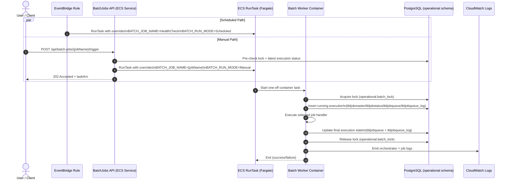
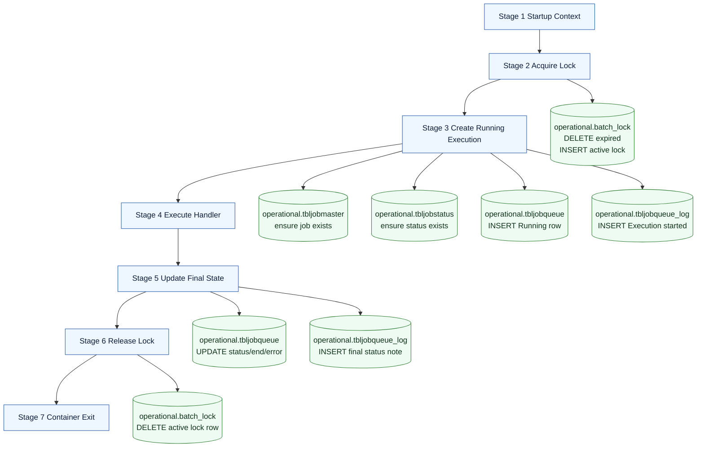

# AWS Services Required for BatchJobs PoC

## Purpose
This document lists the AWS services needed for the current PoC, why each one is required, what it does in the solution, and what happens if it is missing.

PoC objective covered:
- API runs continuously.
- Batch jobs run as one-off containers.
- ScheduleJobs runs on schedule.
- RecreateSummaries, FECProcess, and HealthCheck are API-triggered.

## Architecture Summary
- API image runs in ECS Fargate Service.
- Batch image runs as ECS RunTask on Fargate (ephemeral task per execution).
- EventBridge triggers scheduled job execution.
- API triggers ad-hoc batch runs through ECS RunTask API.
- PostgreSQL stores execution/lock/status records.

## Required Services (Must Have)

### 1) Amazon ECR (Elastic Container Registry)
- Why required:
  - Stores the two container images used by ECS:
    - API image
    - Batch worker image
- What it does:
  - Private container registry from which ECS pulls images.
- If not created:
  - ECS task definitions cannot resolve image URIs.
  - API service and batch tasks fail to start with image pull errors.

### 2) Amazon ECS (Cluster + Task Definitions + Service)
- Why required:
  - ECS is the orchestrator for both always-on API and one-off batch tasks.
- What it does:
  - Cluster: logical compute boundary.
  - Task definitions: runtime blueprint (CPU, memory, env vars, image, logs).
  - Service (API only): keeps API desired count running.
- If not created:
  - No runtime for containers.
  - API endpoint unavailable.
  - No way to run scheduled or ad-hoc jobs.

### 3) AWS Fargate
- Why required:
  - Serverless compute engine for ECS tasks (no EC2 host management).
- What it does:
  - Executes API and batch containers with task-level isolation.
  - Batch tasks naturally stop when process exits.
- If not created/used:
  - Must manage EC2 container instances yourself.
  - Higher operational overhead for PoC.

### 4) Amazon EventBridge (Rule + Target + IAM invoke role)
- Why required:
  - Needed for ScheduleJobs automated execution.
- What it does:
  - Triggers ECS RunTask on defined schedule expression.
  - Passes container overrides, for example BATCH_JOB_NAME=ScheduleJobs.
- If not created:
  - Scheduled jobs never run automatically.
  - You must trigger every job manually.

### 5) Amazon RDS for PostgreSQL
- Why required:
  - BatchJobs design uses persistent storage for locks and execution records.
- What it does:
  - Provides managed PostgreSQL endpoint for API and batch containers.
- If not created:
  - Production-like execution tracking and lock safety are unavailable.
  - You risk duplicate/overlapping job execution and no durable status history.

### 6) IAM Roles and Policies
- Why required:
  - Secure permission boundaries between services.
- What it does:
  - ECS task execution role: pull images and write logs.
  - API task role: call ECS RunTask and pass allowed roles.
  - EventBridge role: run scheduled ECS tasks.
- If not created:
  - Task startup fails (image/log permission denied).
  - API cannot trigger jobs.
  - EventBridge cannot launch scheduled tasks.

### 7) Amazon CloudWatch Logs
- Why required:
  - Runtime observability and diagnosis for API and batch jobs.
- What it does:
  - Stores container stdout/stderr and structured logs.
- If not created:
  - Low visibility into failures and run outcomes.
  - Troubleshooting and validation become slow/risky.

### 8) VPC Networking Components (VPC, Subnets, Security Groups)
- Why required:
  - ECS tasks and RDS need network placement and controlled connectivity.
- What it does:
  - Subnets host ECS ENIs and RDS.
  - Security groups control API ingress and DB access (5432 from app SG).
- If not created:
  - Tasks cannot communicate with database.
  - API may be unreachable.
  - Risk of overexposed or broken network paths.

## Optional but Recommended for Next Step

### 9) Application Load Balancer (ALB)
- Why recommended:
  - Stable API endpoint and health-based routing.
- If not used:
  - You rely on task public IP, which can change after restarts.

### 10) AWS Secrets Manager
- Why recommended:
  - Avoid plain-text DB password in scripts/task env vars.
- If not used:
  - Secret rotation and security posture are weaker.

### 11) CloudWatch Alarms and SNS Notifications
- Why recommended:
  - Alert on failed tasks, API failures, and DB stress.
- If not used:
  - Failures may go unnoticed until users report issues.

## Batch Container Spin Up / Spin Down Behavior
- For batch jobs, use ECS RunTask (not ECS Service).
- Each run starts a new task container.
- When the job process exits, ECS marks the task STOPPED automatically.
- This is the expected and desired pattern for one-off jobs.

## Mapping of Jobs to Trigger Mechanism
- ScheduleJobs:
  - Trigger: EventBridge schedule.
- RecreateSummaries:
  - Trigger: API endpoint -> ECS RunTask.
- FECProcess:
  - Trigger: API endpoint -> ECS RunTask.
- HealthCheck:
  - Trigger: API endpoint -> ECS RunTask.

## PoC Cleanup Reminder
After PoC validation, run cleanup to avoid ongoing cost:
- Delete EventBridge rule/targets.
- Delete ECS service and cluster resources.
- Delete RDS instance if no longer needed.
- Delete IAM roles created only for PoC.
- Delete log groups and security groups if appropriate.

Use the existing cleanup script in this repository for controlled teardown.

## Operations Runbook (PoC)

Use this section for day-to-day checks after deployment.

### Environment Values
- Region: us-east-1
- Cluster: defra-poc-batchjobs-cluster
- API Service: defra-poc-batchjobs-api-svc
- API Log Group: /ecs/defra-poc-batchjobs-api
- Worker Log Group: /ecs/defra-poc-batchjobs-worker
- RDS Host: defra-poc-batchjobs-postgres.crgf0knajwzv.us-east-1.rds.amazonaws.com
- RDS Database: batchjobs

### 1) API Health and Trigger Validation
- Check API health:

```bash
curl -sS -m 20 -w "\nHTTP_STATUS=%{http_code}\n" "http://<API_PUBLIC_IP>:8080/health"
```

- Trigger HealthCheck job:

```bash
curl -sS -m 20 -w "\nHTTP_STATUS=%{http_code}\n" \
  -X POST "http://<API_PUBLIC_IP>:8080/api/batch-jobs/HealthCheck/trigger" \
  -H "accept: */*" \
  -H "Content-Type: application/json" \
  -d ""
```

Expected result:
- Health endpoint returns HTTP 200.
- Trigger endpoint returns HTTP 202 and includes taskArn.

### 2) CloudWatch Log Locations
- API requests and ECS dispatch logs:
  - /ecs/defra-poc-batchjobs-api
- Worker job execution logs:
  - /ecs/defra-poc-batchjobs-worker

Useful strings to search:
- Trigger requested for job
- Started ECS task
- Orchestrator: Starting
- Run completed | Outcome=Succeeded

### 3) ECS Console Checks
- ECS -> Clusters -> defra-poc-batchjobs-cluster
- Service defra-poc-batchjobs-api-svc:
  - Desired/Running task count should be 1/1.
- Tasks tab:
  - Worker runs should appear as one-off tasks that stop after completion.

### 4) Database Validation Queries
Run in psql against batchjobs:

```sql
\dt operational.*

select *
from operational.tbljobqueue
order by startdatetime desc
limit 10;

select *
from operational.tbljobqueue_log
order by logtime desc
limit 20;

select m.jobname, s.status, q.startdatetime, q.enddatetime, q.errormessage
from operational.tbljobqueue q
join operational.tbljobmaster m on m.jobid = q.jobid
join operational.tbljobstatus s on s.statusid = q.statusid
order by q.startdatetime desc
limit 20;
```

### 5) Common Failure Signatures and Fixes
- Symptom: no pg_hba.conf entry ... no encryption
  - Fix: use PostgreSQL SSL in connection string.

- Symptom: password authentication failed for user postgres
  - Fix: reset RDS master password and ensure ECS task env uses same value.

- Symptom: relation operational.batch_lock does not exist
  - Fix: apply runtime schema SQL or ensure API startup DB bootstrap has run.

- Symptom: trigger returns 202 but no worker logs
  - Fix: confirm taskArn exists in ECS tasks, then inspect worker log group and task stopped reason.

- Symptom: local DB client times out on 5432
  - Fix: allow client public IP in DB security group, or use CloudShell/approved network path.

### 6) Security Hygiene After Troubleshooting
- Remove temporary security-group ingress rules added for ad-hoc access.
- Keep DB access limited to required CIDRs/security groups only.
- Prefer Secrets Manager for DB credentials in non-PoC environments.

### 7) Schedule Configuration (Current)
- Business requirement:
  - Run scheduled batch at 8:00 PM GMT (UTC), Monday to Saturday.
- EventBridge cron is UTC-based:
  - 8:00 PM GMT = 20:00 UTC.
- Active schedule expression:

```text
cron(0 20 ? * MON-SAT *)
```

- Verify rule quickly:

```bash
aws events describe-rule \
  --name defra-poc-batchjobs-schedule \
  --region us-east-1 \
  --query "{Name:Name,State:State,ScheduleExpression:ScheduleExpression}" \
  --output json
```

## Current As-Built Runtime Flow (Detailed)

This section describes the exact live flow currently configured and validated in the PoC.

### A) Active Runtime Topology
- API runtime:
  - ECS Service: defra-poc-batchjobs-api-svc
  - Cluster: defra-poc-batchjobs-cluster
  - Launch type: Fargate
  - Desired count: 1 (always-on)
- Batch runtime:
  - ECS one-off RunTask (ephemeral)
  - Task definition family: defra-poc-batchjobs-worker (current rev: :3)
  - Container name: batchjobs-worker
  - Launch type: Fargate
  - Network mode: awsvpc
- Database runtime:
  - RDS PostgreSQL
  - DB: batchjobs
  - Schema used by runtime: operational

### B) EventBridge Scheduler Wiring (Current)
- Rule name: defra-poc-batchjobs-schedule
- Rule state: ENABLED
- Rule expression (current): cron(0 20 ? * MON-SAT *)
  - Meaning: 8:00 PM UTC (GMT), Monday-Saturday
- Target type: ECS RunTask (Fargate)
- Target payload (Input):
  - BATCH_JOB_NAME=HealthCheck
  - BATCH_RUN_MODE=Scheduled

Important:
- The scheduler currently invokes HealthCheck, not ScheduleJobs.
- ScheduleJobs exists in code but is not the current EventBridge target payload.

### B1) Compact Sequence View (Scheduled + Manual)



### B2) DB Mutation by Stage (Compact)



### C) API-to-Batch Dispatch Flow (Manual Trigger)
1. Client calls API endpoint:
   - POST /api/batch-jobs/{jobName}/trigger
2. API pre-check phase:
   - Reads active lock from operational.batch_lock for {jobName}
   - Reads last execution from:
     - operational.tbljobqueue
     - operational.tbljobmaster
     - operational.tbljobstatus
3. If no running lock exists:
   - API calls ECS RunTask with overrides:
     - BATCH_JOB_NAME={jobName}
     - BATCH_RUN_MODE=Manual
4. API response:
   - HTTP 202 Accepted
   - Returns taskArn/operationId
5. ECS starts one batch worker task on Fargate; task stops automatically after process exit.

### D) Worker Execution Pipeline (Same for All Jobs)
Once worker starts, the pipeline is the same regardless of job name.

Stage 1 - Startup and context
- Worker reads:
  - BATCH_JOB_NAME (default fallback is HealthCheck if missing)
  - BATCH_RUN_MODE (default fallback Manual)
- Logs startup metadata and run context.

Stage 2 - Lock acquisition
- Table touched: operational.batch_lock
- Steps:
  - Deletes expired lock rows for the same job name
  - Inserts a new active lock row with run_id and expires_at
  - Unique partial index enforces one active lock per job name
- If lock cannot be acquired:
  - Run is skipped (no overlapping execution)

Stage 3 - Create execution record (Running)
- Tables touched:
  - operational.tbljobmaster (ensure job exists; insert if missing)
  - operational.tbljobstatus (ensure status exists; insert if missing)
  - operational.tbljobqueue (insert execution row as Running)
  - operational.tbljobqueue_log (insert "Execution started")

Stage 4 - Execute job handler
- BatchJobFactory resolves IBatchJob by Name.
- Orchestrator executes with retry policy.
- Current implemented behavior by job is listed in section E.

Stage 5 - Update execution record (Completed/Failed/Cancelled)
- Tables touched:
  - operational.tbljobqueue (status, enddatetime, errormessage)
  - operational.tbljobqueue_log (insert final status note)

Stage 6 - Release lock
- Table touched: operational.batch_lock
- Deletes the lock row for job_name + run_id.

Stage 7 - Container exits
- ECS task transitions to STOPPED.
- Exit code:
  - 0 for success
  - non-zero for failures/cancellation categories

### E) Process-by-Process Current State

#### 1) HealthCheck
- Trigger modes:
  - Scheduled (EventBridge target currently points here)
  - Manual (API trigger)
- RunMode observed:
  - Scheduled for cron runs
  - Manual for API-triggered runs
- Handler behavior:
  - Active validation flow (configuration + simulated processing loop)
  - Emits progress logs (10/50, 20/50, etc.)
  - Validates repository/database write path through orchestrator persistence
- DB updates:
  - Full lock + execution create/update + log lifecycle
- Status:
  - Working end-to-end

#### 2) RecreateSummaries
- Trigger mode:
  - Manual (API trigger)
- RunMode observed:
  - Manual
- Handler behavior:
  - Foundation placeholder (no business transformation yet)
  - Returns success quickly
- DB updates:
  - Full lock + execution create/update + log lifecycle still occurs
- Status:
  - Pipeline working; business logic placeholder

#### 3) FECProcess
- Trigger mode:
  - Manual (API trigger)
- RunMode observed:
  - Manual
- Handler behavior:
  - Foundation placeholder (awaiting business requirements/design)
  - Returns success quickly
- DB updates:
  - Full lock + execution create/update + log lifecycle still occurs
- Status:
  - Pipeline working; business logic placeholder

#### 4) ScheduleJobs
- Trigger mode currently configured:
  - Not wired as EventBridge target in current live setup
- Handler behavior:
  - Foundation placeholder
  - Has schedule metadata in code, but scheduler target payload currently invokes HealthCheck
- DB updates when manually triggered:
  - Full lock + execution create/update + log lifecycle
- Status:
  - Available in code and API-triggerable; not the active scheduled payload target

### F) ECS/Fargate Configuration Snapshot (Current)
- API service:
  - Runs continuously via ECS Service
  - Public IP assignment enabled through awsvpc config
- Batch RunTask:
  - TaskCount=1
  - LaunchType=FARGATE
  - PlatformVersion=LATEST
  - awsvpcConfiguration:
    - Subnets: default VPC subnet set used during provisioning
    - SecurityGroups: API SG for worker task networking path
    - AssignPublicIp: ENABLED

### G) Tables and Purpose
- operational.batch_lock
  - Distributed lock table; prevents concurrent same-job runs
- operational.tbljobmaster
  - Job catalog entries (auto-created if absent)
- operational.tbljobstatus
  - Status dimension (Running, Completed, etc.) per job
- operational.tbljobqueue
  - One row per run (start/end/status/error)
- operational.tbljobqueue_log
  - Chronological status/audit trail per run

### H) Quick Verification Checklist
1. API health returns HTTP 200.
2. Trigger endpoint returns HTTP 202 with taskArn.
3. Worker task reaches STOPPED with ExitCode=0 for successful runs.
4. CloudWatch worker logs show:
   - Requested job + RunMode
   - Orchestrator start/finish
   - Final run summary
5. DB tables show new queue and queue_log records for each run.
