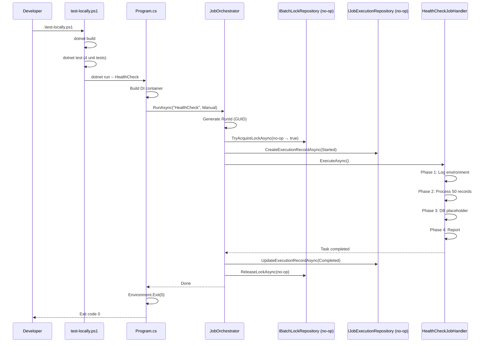
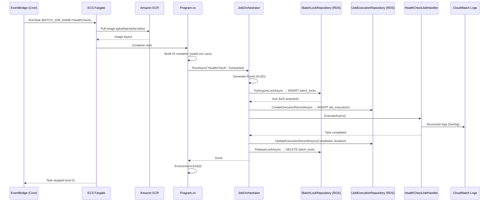

# Batch Jobs: Execution Flow and AWS Transition

> **Purpose:** End-to-end flow of how a batch job runs today (locally) and how the exact same
> code will run once the AWS environment is ready. Nothing changes in the application code —
> only the trigger mechanism and the database backend change.

---

## 1. The Big Picture — What We Are Building

A **batch job framework** that:

- Is triggered by a **schedule** (e.g. every day at 2 AM)
- **Prevents concurrent runs** using a distributed lock
- **Records every run** (started → running → completed / failed)
- Runs a named job by passing `BATCH_JOB_NAME=HealthCheck` (or any future job)
- Exits with a clear exit code so the scheduler knows if it succeeded

The same Docker image runs in both environments. Only where it is triggered from changes.

---

## 2. Current State (Local) — Full Execution Flow

```
Developer runs: .\test-locally.ps1
        │
        ▼
┌─────────────────────────────────────┐
│       test-locally.ps1              │
│                                     │
│  1. dotnet build                    │
│  2. dotnet test (4 unit tests)       │
│  3. dotnet run -- HealthCheck       │
└──────────────┬──────────────────────┘
               │
               ▼
┌─────────────────────────────────────────────────────────┐
│                    Program.cs (entry point)              │
│                                                         │
│  Reads job name → args[0] or BATCH_JOB_NAME env var    │
│  Builds DI container (ServiceCollectionSetup)           │
│  Resolves IJobOrchestrator                              │
│  Calls orchestrator.RunAsync("HealthCheck", Manual)      │
└──────────────┬──────────────────────────────────────────┘
               │
               ▼
┌─────────────────────────────────────────────────────────┐
│                   JobOrchestrator                        │
│                                                         │
│  Step 1 → Generate RunId (GUID)                         │
│  Step 2 → Try acquire lock via IBatchLockRepository     │
│           └ If already locked → exit 4 (skipped)        │
│  Step 3 → Write "Started" execution record              │
│  Step 4 → Create job via IBatchJobFactory               │
│  Step 5 → Call job.ExecuteAsync()                       │
│  Step 6 → Write "Completed" record (with duration)      │
│  Step 7 → Release lock (always, in finally)             │
└──────────────┬──────────────────────────────────────────┘
               │
               ▼
┌─────────────────────────────────────────────────────────┐
│               HealthCheckJobHandler                     │
│                                                         │
│  Phase 1 → Log environment info                         │
│  Phase 2 → Process 50 simulated records                 │
│  Phase 3 → DB connectivity placeholder                  │
│  Phase 4 → Report results                               │
└─────────────────────────────────────────────────────────┘
               │
               ▼
    Exit 0 (success) or non-zero (failure)
```

**What is "local" about this today:**
- No real database → lock and execution record writes are **no-ops** (simulated)
- No container — runs as a plain `dotnet run`
- No scheduler — developer triggers it manually

---

## 3. Future State (AWS) — Full Execution Flow

```
     Amazon EventBridge (Cron: 0 2 * * ? *)
               │
               │  RunTask API call with:
               │    - Task Definition ARN
               │    - Environment: BATCH_JOB_NAME=HealthCheck
               │    - Subnets, Security Groups
               ▼
     Amazon ECS (Fargate launch type)
               │
               │  Pulls image from:
               │    {account}.dkr.ecr.{region}.amazonaws.com/apha/batchjobs:{tag}
               ▼
     Container Starts (Linux, .NET 10)
               │
               ▼
┌─────────────────────────────────────────────────────────┐
│                    Program.cs (same code)                │
│                                                         │
│  Reads BATCH_JOB_NAME env var → "HealthCheck"           │
│  Builds DI container                                    │
│  Resolves IJobOrchestrator                              │
│  Calls orchestrator.RunAsync("HealthCheck", Scheduled)  │
└──────────────┬──────────────────────────────────────────┘
               │
               ▼
┌─────────────────────────────────────────────────────────┐
│                   JobOrchestrator (same code)            │
│                                                         │
│  Step 1 → Generate RunId (GUID)                         │
│  Step 2 → Acquire lock in RDS PostgreSQL                │
│           └ If another container is already running →   │
│             exit 4 (prevents duplicate runs)            │
│  Step 3 → Write "Started" to RDS                        │
│  Step 4 → Create job via factory                        │
│  Step 5 → Run job (real business logic here)            │
│  Step 6 → Write "Completed" to RDS (duration, counts)   │
│  Step 7 → Release lock from RDS                         │
└──────────────┬──────────────────────────────────────────┘
               │
               ▼
┌─────────────────────────────────────────────────────────┐
│               HealthCheckJobHandler (same code)          │
│   (or FpsArchiveJob, PimsDataLoadJob, etc.)             │
└─────────────────────────────────────────────────────────┘
               │
               ▼
     Container exits (0 = success, non-zero = failure)
               │
     ECS reports exit code to CloudWatch
               │
     CloudWatch Alarm triggers SNS → Email/PagerDuty
```

---

## 4. Side-by-Side Comparison

| Aspect | Local (Now) | AWS (When Ready) |
|---|---|---|
| **Trigger** | `.\test-locally.ps1` or `dotnet run` | EventBridge cron schedule |
| **Container** | No container — plain `dotnet run` | Fargate container pulled from ECR |
| **Image Registry** | N/A | Amazon ECR (`apha/batchjobs`) |
| **Job Name Source** | `args[0]` or env var | `BATCH_JOB_NAME` env var in Task Definition |
| **Database** | No real DB — lock/record writes are no-ops | Amazon RDS PostgreSQL |
| **Lock Storage** | Simulated (in-memory / no-op) | `batch_locks` table in RDS |
| **Execution Records** | Simulated (no-op) | `job_executions` table in RDS |
| **Logs** | Console/terminal output | Amazon CloudWatch Logs |
| **Failure Alerting** | Dev sees exit code in terminal | CloudWatch Alarm → SNS → Email |
| **Scheduling** | Manual / VS Code task | Automated, AWS-managed |
| **Run Mode** | `Manual` | `Scheduled` |

**Application code is identical in both environments.** The only difference is the infrastructure around it.

---

## 5. What Changes When AWS Is Ready

### 5a. Add to AWS (one-time setup, no code changes)

```
AWS Resources to Create:
├── ECR Repository: apha/batchjobs
├── ECS Cluster: apha-batch-cluster
├── ECS Task Definition: apha-batchjobs-task
│   ├── Image: {account}.dkr.ecr.{region}.amazonaws.com/apha/batchjobs:latest
│   ├── Env: BATCH_JOB_NAME=HealthCheck
│   ├── Env: ASPNETCORE_ENVIRONMENT=Production
│   ├── Env: DB_HOST, DB_PORT, DB_NAME (from SSM Parameter Store)
│   └── LogGroup: /ecs/apha-batchjobs
├── EventBridge Schedule: HealthCheck-Daily
│   ├── Cron: 0 2 * * ? *  (2 AM UTC daily)
│   └── Target: ECS RunTask with Task Definition above
└── CloudWatch Alarm on container exit code != 0
```

### 5b. Changes in Application Code

Only two small changes when switching from local (no-op) to real AWS:

1. **Database Connection String** — populated from SSM Parameter Store via environment variables
   (already designed for this — `DatabaseSettings.BuildConnectionString()` reads env vars)

2. **Lock + Record writes start hitting real PostgreSQL** — no code change needed, the
   repositories already exist. They were just no-ops until the DB is reachable.

That's it. The orchestration, factory, and job code are already correct.

---

## 6. Mermaid Sequence Diagram — Local vs AWS

### 6a. Local Execution Today



### 6b. AWS Scheduled Execution (Future)



---

## 7. Exit Codes (Same in Both Environments)

| Code | Meaning | AWS Reaction |
|---|---|---|
| `0` | Success | CloudWatch: OK |
| `1` | Unhandled exception / fatal | CloudWatch Alarm fires |
| `2` | Invalid job name (factory error) | CloudWatch Alarm fires |
| `3` | Job was cancelled (graceful shutdown) | ECS draining — not an alarm |
| `4` | Lock already held — another run is active | Normal — EventBridge overlap |

---

## 8. Where We Are on This Journey

```
Phase 1 — Foundation [DONE]
 ✓ IBatchJob interface
 ✓ IBatchJobFactory + BatchJobFactory
 ✓ HealthCheckJobHandler
 ✓ DI container (ServiceCollectionSetup)
 ✓ Program.cs one-shot execution
 ✓ Exit codes

Phase 2 — Execution Orchestration [IN PROGRESS]
 ✓ IBatchLockRepository + IJobExecutionRepository interfaces (done)
 ✓ Domain entities: BatchLock, JobExecutionRecord (done)
 → IJobOrchestrator interface
 → JobOrchestrator implementation
 → Wire orchestrator into Program.cs
 → Unit tests for orchestrator

Phase 3 — Local DB (Optional Pre-AWS Milestone)
 → docker-compose postgres (Linux host / CI only)
 → Or local PostgreSQL install
 → Real lock and execution record writes verified locally

Phase 4 — AWS Infrastructure
 → ECR repository + push CI pipeline (CI workflow already written)
 → ECS Task Definition
 → EventBridge schedule
 → RDS PostgreSQL with batch schema
 → CloudWatch alarms
 → SSM Parameter Store secrets

Phase 5 — Production Jobs
 → Replace HealthCheck placeholder logic with real business jobs
 → FpsArchiveJob, PimsDataLoadJob, etc.
```

---

## 9. Key Design Decision (Recommendation)

> **One image. One entry point. Many jobs.**

Do not create a separate Docker image per job. Instead:

```
BATCH_JOB_NAME=HealthCheck   → runs HealthCheckJobHandler
BATCH_JOB_NAME=FpsArchive    → runs FpsArchiveJobHandler
BATCH_JOB_NAME=PimsDataLoad  → runs PimsDataLoadJobHandler
```

Each **EventBridge schedule** has one **Task Definition** that only differs in the
`BATCH_JOB_NAME` environment variable override. This means:

- One Docker build per release
- One CI pipeline
- One set of infrastructure, many schedules
- Adding a new job = add a handler class + register it in DI + add an EventBridge rule

This is the pattern already in place. The factory and DI registration already follow it.
