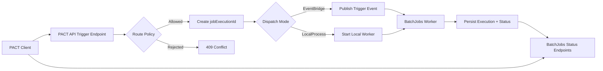
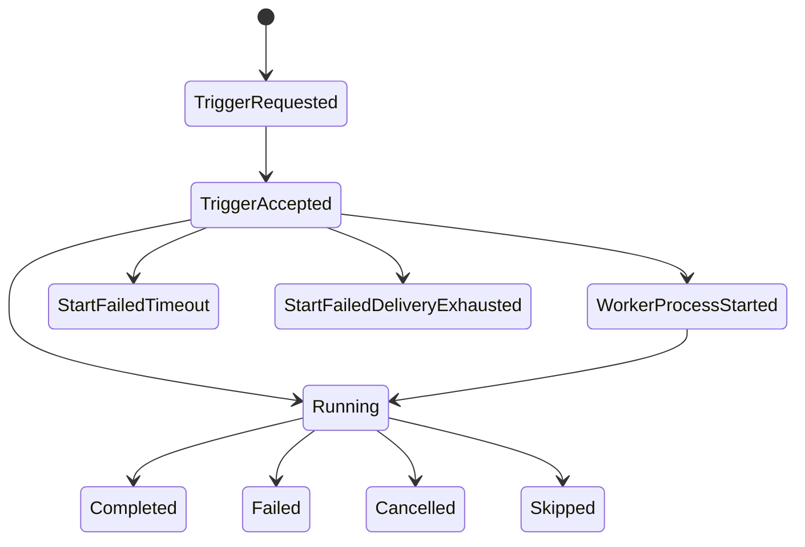

# PACT to BatchJobs Hand-off

Date: 2026-06-02
Audience: PACT API team, BatchJobs team, integration testers

## 1. Purpose

This hand-off describes:
1. The overall trigger-to-execution flow between PACT API and BatchJobs.
2. A shared transition-state model that both systems can adopt.
3. Endpoint contracts and when to call each endpoint.
4. A concrete PACT API implementation pattern for an EventGrid-based trigger path.

## 2. Current Runtime Architecture (as implemented)

Current implementation in this repository uses EventBridge for cloud dispatch, with optional local process dispatch in development:
1. PACT API receives trigger request.
2. PACT API validates route policy and creates `jobExecutionId`.
3. PACT API dispatches event:
   - Cloud mode: EventBridge publisher.
   - Local mode: starts worker process directly (`localproc-<pid>`).
4. BatchJobs worker executes the job and persists execution status.
5. Status APIs can be polled from BatchJobs API for run state and lock state.



## 3. Shared Transition States (PACT API + BatchJobs)

Use these as cross-system contract states. They are intentionally transport-agnostic.

### 3.1 Canonical state list

1. `TriggerRequested`
2. `TriggerAccepted`
3. `WorkerProcessStarted` (local/dev only)
4. `Running`
5. `Completed`
6. `Failed`
7. `Cancelled`
8. `Skipped`
9. `StartFailedTimeout`
10. `StartFailedDeliveryExhausted`

### 3.2 Ownership and meaning

1. `TriggerRequested`
   - Produced by: client/UI intent.
   - Meaning: trigger command submitted to PACT API.

2. `TriggerAccepted`
   - Produced by: PACT API trigger endpoint (`202 Accepted`).
   - Meaning: request validated and accepted for dispatch.

3. `WorkerProcessStarted`
   - Produced by: PACT local dispatcher only.
   - Meaning: worker PID launched locally.

4. `Running`
   - Produced by: BatchJobs execution layer.
   - Meaning: active lock + in-flight execution.

5. `Completed`
   - Produced by: BatchJobs execution layer.
   - Meaning: run finished successfully.

6. `Failed`
   - Produced by: BatchJobs execution layer.
   - Meaning: run failed.

7. `Cancelled`
   - Produced by: BatchJobs execution layer.
   - Meaning: run cancelled.

8. `Skipped`
   - Produced by: BatchJobs execution layer.
   - Meaning: run intentionally skipped (for example, concurrent lock already held).

9. `StartFailedTimeout`
   - Produced by: integration/UI watchdog layer.
   - Meaning: accepted trigger did not transition to observable running state before startup SLA deadline.

10. `StartFailedDeliveryExhausted`
   - Produced by: integration transport layer.
   - Meaning: dispatch retries exhausted before worker start was observed.

### 3.3 State transition contract



Notes:
1. `WorkerProcessStarted` is optional and expected mainly in local mode.
2. `Running`/`Completed`/`Failed`/`Cancelled`/`Skipped` should come from BatchJobs status source of truth.
3. `StartFailed*` states should be computed by monitoring/polling policy when no running signal appears in time.

## 4. Endpoint Matrix and Usage

### 4.1 PACT API endpoints

Base route: `/api/v1/batch-jobs`

1. `GET /api/v1/batch-jobs/catalog`
   - Purpose: discover jobs visible from PACT API and route restrictions.
   - Use when: initializing UI or validating job routing.

2. `POST /api/v1/batch-jobs/trigger`
   - Body:
     ```json
     {
       "jobName": "RecreateSummaries",
       "requestedBy": "user@domain"
     }
     ```
   - Success: `202 Accepted` with `jobExecutionId`, `eventId`, `status`.
   - Failure: `409 Conflict` when route policy rejects request.
   - Use when: initiating execution.

3. `GET /health`
   - Purpose: service readiness/liveness check.
   - Use when: pre-flight checks before trigger operations.

### 4.2 BatchJobs API endpoints

Base route: `/api/batch-jobs`

1. `GET /api/batch-jobs`
   - Purpose: get current status for all jobs.
   - Use when: dashboard or fleet-level monitoring.

2. `GET /api/batch-jobs/{jobName}/status`
   - Purpose: point-in-time status of one job.
   - Returns lock info and last execution summary.
   - Use when: polling run progress for a specific job.

3. `GET /api/batch-jobs/{jobName}/can-run`
   - Purpose: pre-check before enabling trigger action.
   - Use when: page load and right before trigger click.

4. `POST /api/batch-jobs/{jobName}/trigger`
   - Purpose: trigger through BatchJobs API directly (alternate path).
   - Returns `202` with `jobExecutionId`.
   - Use when: integration is anchored on BatchJobs API instead of PACT/FPS APIs.

5. `GET /health`
   - Purpose: BatchJobs API health.
   - Use when: dependency checks and synthetic monitoring.

## 5. Polling Strategy (recommended)

### 5.1 Trigger and startup phase

1. Call PACT `POST /api/v1/batch-jobs/trigger`.
2. If `202`, move to `TriggerAccepted`.
3. Start startup watchdog timer (example: 10 minutes).
4. Poll BatchJobs status endpoint every 2-5 seconds initially.

### 5.2 Running and completion phase

1. If running lock appears, move to `Running`.
2. Continue polling every 10-15 seconds while running.
3. End states from BatchJobs status:
   - `Completed`
   - `Failed`
   - `Cancelled`
   - `Skipped`
4. If startup deadline exceeded without running evidence, set `StartFailedTimeout`.

### 5.3 Polling endpoint selection

1. Use `GET /api/batch-jobs/{jobName}/status` for focused execution tracking.
2. Use `GET /api/batch-jobs` only for dashboard/list scenarios.
3. Use `GET /api/batch-jobs/{jobName}/can-run` for pre-trigger guardrails.

## 6. EventGrid Approach for PACT API (target implementation)

This section defines how to implement equivalent behavior when transport is Azure EventGrid.

Important:
1. Current repository implementation is EventBridge-centric.
2. The design below is the EventGrid-compatible pattern for PACT API, preserving the same trigger contract and state model.

### 6.1 PACT API transport abstraction

Use a dispatcher abstraction so EventGrid can replace EventBridge without changing controller contract.

```csharp
public interface ITriggerDispatcher
{
    Task<string> DispatchAsync(BatchTriggerEventDetail detail, CancellationToken cancellationToken = default);
}
```

### 6.2 EventGrid dispatcher contract

Suggested implementation details:
1. Create an `EventGridTriggerDispatcher` implementing `ITriggerDispatcher`.
2. Publish CloudEvents using `Azure.Messaging.EventGrid`.
3. Return EventGrid event id as `eventId`.

Event payload contract (recommended):
```json
{
  "jobExecutionId": "string-guid-no-dashes-or-guid",
  "jobName": "RecreateSummaries",
  "runMode": "Manual",
  "requestedBy": "user@domain",
  "requestedAtUtc": "2026-06-02T12:00:00Z"
}
```

Event metadata recommendation:
1. `type`: `BatchJob.TriggerRequested`
2. `subject`: `/batch-jobs/{jobName}`
3. `source`: `pact.api`
4. `id`: same as `jobExecutionId` or generated event id
5. `datacontenttype`: `application/json`

### 6.3 PACT API configuration shape (example)

```json
{
  "TriggerDispatch": {
    "Mode": "EventGrid"
  },
  "EventGrid": {
    "Endpoint": "https://<topic-name>.<region>-1.eventgrid.azure.net/api/events",
    "AccessKeySecretName": "EventGrid--AccessKey",
    "EventType": "BatchJob.TriggerRequested",
    "Source": "pact.api"
  }
}
```

### 6.4 Suggested C# skeleton for EventGrid dispatcher

```csharp
public sealed class EventGridTriggerDispatcher : ITriggerDispatcher
{
    private readonly EventGridPublisherClient _client;
    private readonly EventGridOptions _options;

    public EventGridTriggerDispatcher(EventGridPublisherClient client, IOptions<EventGridOptions> options)
    {
        _client = client;
        _options = options.Value;
    }

    public async Task<string> DispatchAsync(BatchTriggerEventDetail detail, CancellationToken cancellationToken = default)
    {
        var cloudEvent = new CloudEvent(
            source: _options.Source,
            type: _options.EventType,
            data: BinaryData.FromObjectAsJson(new
            {
                detail.JobExecutionId,
                detail.JobName,
                detail.RunMode,
                detail.RequestedBy,
                detail.RequestedAtUtc
            }))
        {
            Subject = $"/batch-jobs/{detail.JobName}",
            Id = detail.JobExecutionId,
            DataContentType = "application/json"
        };

        await _client.SendEventAsync(cloudEvent, cancellationToken);
        return cloudEvent.Id;
    }
}
```

### 6.5 Controller response contract (keep unchanged)

Keep PACT API trigger response shape stable even when transport changes:
1. `accepted`
2. `source`
3. `jobName`
4. `jobExecutionId`
5. `eventId`
6. `status`
7. `acceptedAtUtc`
8. `message`

This stability lets UIs and callers avoid transport-specific branching.

## 7. End-to-End Sequence for PACT Team

1. Call `GET /health` on PACT API.
2. Call `GET /api/v1/batch-jobs/catalog` and confirm target job is triggerable from PACT.
3. Call `POST /api/v1/batch-jobs/trigger`.
4. Capture `jobExecutionId` from `202` response.
5. Poll BatchJobs `GET /api/batch-jobs/{jobName}/status`.
6. Translate observations into shared state machine.
7. Stop polling on terminal states: `Completed`, `Failed`, `Cancelled`, `Skipped`.
8. Raise startup failure states when startup SLA expires without running signal.

## 8. Operational Agreement Checklist

1. PACT and BatchJobs both emit and log `jobExecutionId` for correlation.
2. PACT trigger response remains transport-agnostic.
3. BatchJobs status endpoint remains source of truth for run outcome.
4. Startup timeout and retry exhaustion thresholds are agreed and documented.
5. Monitoring dashboards expose shared state names, not transport-specific details.

## 9. Quick Examples

### 9.1 Trigger request

```bash
curl -X POST "http://localhost:5189/api/v1/batch-jobs/trigger" \
  -H "Content-Type: application/json" \
  -d '{"jobName":"RecreateSummaries","requestedBy":"pact.user@local"}'
```

### 9.2 Poll job status

```bash
curl "http://localhost:5261/api/batch-jobs/RecreateSummaries/status"
```

### 9.3 Pre-check can-run

```bash
curl "http://localhost:5261/api/batch-jobs/RecreateSummaries/can-run"
```
