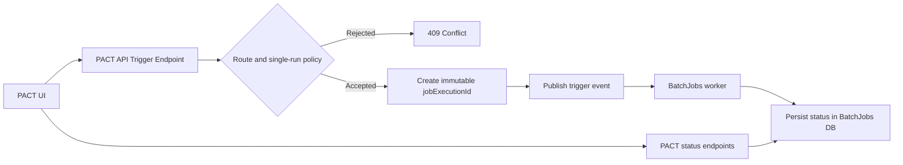
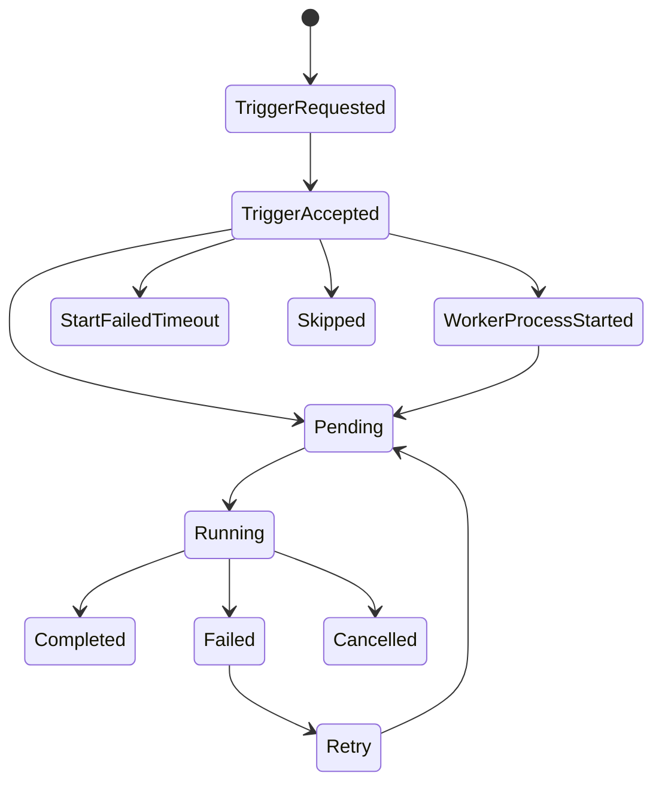

# PACT to BatchJobs Hand-off (Aligned)

Date: 2026-06-03  
Audience: PACT API team, BatchJobs team, integration testers

## 1. Purpose

This hand-off defines a shared and implementable contract between PACT and BatchJobs for:
1. Trigger acceptance and dispatch
2. Run-state ownership and transitions
3. Correlated status polling
4. Event transport behavior (EventBridge now, EventGrid-ready pattern)

## 2. Decisions Locked for This Integration

1. **Concurrency rule**: single execution per job name at any point in time.
2. **Correlation id**: `jobExecutionId` is globally unique and immutable for one accepted trigger.
3. **Authoritative ledger**: BatchJobs DB is the single source of truth for state transitions.
4. **Startup SLA**: configurable per environment, with recommended defaults:
   - Production: 10 minutes
   - Non-production: 3 minutes
5. **Identity**: `requestedBy` should be server-derived from authenticated principal where available.
6. **Event identity**: keep `eventId` distinct from `jobExecutionId`.

## 3. Runtime Architecture (Current + Target)

Current dispatch path in this repo:
1. PACT API accepts `POST /api/v1/batch-jobs/trigger`
2. PACT API creates `jobExecutionId`
3. Dispatcher publishes trigger event (EventBridge in current implementation)
4. BatchJobs worker starts and records execution in BatchJobs DB
5. UI polls PACT status APIs using correlation id (`/api/batch-jobs/...`), and PACT queries BatchJobs-backed services/DB



## 4. Shared Transition Model

### 4.1 Persistent DB States (Source of Truth in `fps.job_status` Reference Table)

**7 states** are defined in the `fps.job_status` reference table (one row per job per status):

1. **`Pending`** – Job is queued and waiting to be executed by a worker.
2. **`Running`** – Job is currently executing.
3. **`Completed`** – Job completed successfully.
4. **`Failed`** – Job failed with an error.
5. **`Cancelled`** – Job was cancelled before or during execution.
6. **`Retry`** – Job encountered a retryable error; retry is scheduled.
7. **`Skipped`** – Job was skipped (e.g., due to single-run policy or lock collision).

**Business-relevant terminal states**: `Completed`, `Failed`, `Cancelled`, `Skipped`.
**Active/in-progress states**: `Pending`, `Running`, `Retry`.
**Notes**: 
- The `fps.job_status` table is a **reference table** (one row per job × status) that defines which statuses apply to each job.
- The `fps.job_queue` table stores **actual execution records** with their current status.
- Not all statuses may be used by every job; some jobs may never transition through `Retry` or `Skipped`.

### 4.2 Transient Polling States (API Projections, NOT in DB)

These states are **computed on-the-fly by the status API** for better UX during startup. They do **not** represent database rows and are used only by polling clients during the waiting-for-worker-visibility phase.

1. **`TriggerRequested`** – Client-side intent (UI state only, never sent to API).
2. **`TriggerAccepted`** – PACT trigger endpoint accepted the request (202 Accepted); worker not yet visible in DB.
3. **`WorkerProcessStarted`** – Local process dispatcher reports worker spawned (local mode only); execution not yet visible in DB.
4. **`StartFailedTimeout`** – Watchdog projection: `acceptedAtUtc` + `startupSlaSeconds` deadline exceeded with no execution record observed.

**Purpose**: Show users meaningful feedback during the 10-180 second startup window while the worker is starting and hasn't written to the DB yet.

### 4.3 Startup Watchdog Mechanism

**When does watchdog activate?**
- PACT status endpoint receives a request with `jobExecutionId` + `acceptedAtUtc` parameters.
- No execution record exists yet in the BatchJobs DB.
- API computes projected state based on time elapsed since `acceptedAtUtc`.

**Watchdog computation (in PACT API /api/batch-jobs/{jobName}/status endpoint):**
```csharp
if (execution is null && acceptedAtUtc.HasValue)
{
    var now = DateTime.UtcNow;
    var startupSlaSeconds = environment.IsProduction() ? 600 : 180;
    var startupDeadlineUtc = acceptedAtUtc.Value.AddSeconds(startupSlaSeconds);
    
    var projectedState = now > startupDeadlineUtc 
        ? "StartFailedTimeout"           // Deadline passed, worker never appeared
        : "TriggerAcceptedPendingStart"; // Still within SLA window, waiting for visibility
}
```

**Watchdog response payload (only when execution not yet visible):**
```json
{
  "startupWatchdog": {
    "projectedState": "TriggerAcceptedPendingStart",
    "acceptedAtUtc": "2026-06-03T12:00:00Z",
    "startupDeadlineUtc": "2026-06-03T12:03:00Z",
    "evaluatedAtUtc": "2026-06-03T12:00:30Z",
    "startupSlaSeconds": 180,
    "deliveryExhaustionConfirmed": false
  }
}
```

### 4.4 Ownership

1. **DB reference states** (`Pending`, `Running`, `Completed`, `Failed`, `Cancelled`, `Retry`, `Skipped`): Defined in `fps.job_status` reference table; authoritative source of truth for allowed states per job.
2. **DB execution states**: `fps.job_queue` table stores the current status of each job execution instance (jobqueueid → statusid).
3. **Transient states** (`TriggerAccepted`, `WorkerProcessStarted`, `StartFailedTimeout`): Computed on-the-fly by PACT status API based on timing and DB observation.
4. **Watchdog deadline logic**: PACT API is responsible for projecting startup failure if no execution record appears before SLA deadline.

### 4.5 Valid State Transitions



**Key notes:**
1. **7 states** persist to `fps.job_status`: `Pending`, `Running`, `Completed`, `Failed`, `Cancelled`, `Retry`, `Skipped`.
2. **Transient states** (`TriggerAccepted`, `WorkerProcessStarted`, `StartFailedTimeout`) are API projections, not DB rows.
3. **Watchdog phase**: When `acceptedAtUtc` is known but execution not yet visible in DB, API projects `TriggerAcceptedPendingStart`.
4. **Normal flow**: `Pending` → `Running` → `Completed` (or `Failed` or `Cancelled`).
5. **Retry flow**: `Running` → `Failed` → `Retry` → `Pending` → `Running`.
6. **Skipped**: Job rejected at acceptance time (e.g., lock collision, already running).
7. **Watchdog timeout**: If no `Pending` record appears before SLA deadline, API projects `StartFailedTimeout`.

## 5. UI Business Logic: Which States to Display

### 5.1 Production UI Recommendation (Minimal Polling Feedback)

Show **only these states** to business users:

| State | Label | Color | User Meaning | Duration | Source |
|-------|-------|-------|--------------|----------|--------|
| Ready | Ready | Green | Job can be triggered now | Before trigger | UI local |
| TriggerAcceptedPendingStart | Pending / Queued | Blue | Job accepted, waiting to start | 0–3 min (prod: 0–10 min) | Watchdog |
| Pending | Pending | Blue | Job is queued but not yet running | Variable (seconds to minutes) | DB |
| Running | Running | Blue | Job is executing | Variable (seconds to hours) | DB |
| Retry | ⟳ Retry Scheduled | Orange | Job failed; retry is queued | After failure detection | DB |
| Completed | ✓ Completed | Green | Job finished successfully | After completion | DB |
| Failed | ✗ Failed | Red | Job failed with error | After failure | DB |
| Cancelled | ⊘ Cancelled | Gray | Job was cancelled | After cancellation | DB |
| Skipped | ⊘ Skipped | Gray | Job was not started (concurrent run) | Immediate on trigger | DB |
| StartFailedTimeout | ✗ Startup Timeout | Red | Worker didn't start within SLA | After SLA deadline exceeded | Watchdog |

**Why show `Pending` (DB state)?**
- Distinguishes the queued/startup phase from active execution.
- Watchdog projection `TriggerAcceptedPendingStart` is an interim label while DB `Pending` record is being written.
- Shows user confidence that job was accepted and is moving through the startup pipeline.

**Why show `Retry` and `Skipped` (DB states)?**
- Helps users understand why a job didn't complete on first attempt.
- `Retry` signals automatic recovery in progress.
- `Skipped` explains why a trigger was rejected (e.g., concurrent run protection).

**Why NOT show `TriggerAccepted` or `WorkerProcessStarted`?**
- These are **internal polling artifacts**, not job states.
- `TriggerAccepted` is implied by the 202 response and automatic polling start.
- `WorkerProcessStarted` is local mode noise; users care about actual progress, not process management.
- Showing both creates UI clutter and confusion: "What's the difference between Accepted and Running?"

### 5.2 Sample UI Implementation (Current)

The Sample UI in this repo shows more states for **demo/debugging purposes**:
- `TriggerAccepted` – For testing API response flow.
- `WorkerProcessStarted` – For local development debugging.
- Scenario preview mode – Allows manual state injection for UI testing.

**For production UI, simplify the state set per the table above.**

## 6. Endpoint Matrix (Contract)


### 5.1 PACT API

Base routes:
1. Trigger route: `/api/v1/batch-jobs`
2. Status route: `/api/batch-jobs`

1. `GET /api/v1/batch-jobs/catalog`
   - Discover jobs and route policy.
2. `POST /api/v1/batch-jobs/trigger`
   - Request body:
     ```json
     {
       "jobName": "RecreateSummaries",
       "requestedBy": "user@domain"
     }
     ```
   - Behavior:
     - `202 Accepted` with `jobExecutionId`, `eventId`, `status`.
     - `409 Conflict` on route or single-run conflict.
   - Identity note:
     - `requestedBy` from body is advisory in local/dev.
     - In integrated environments, server should derive identity from principal/claims.
3. `GET /health`
4. `GET /api/batch-jobs/{jobName}/can-run`
   - Guardrail for UI enablement.
   - Backed by BatchJobs status service/DB query.
5. `GET /api/batch-jobs/{jobName}/status?jobExecutionId=<guid>&acceptedAtUtc=<ISO-8601>`
   - Correlated status for a specific accepted trigger.
   - Returns source-of-truth execution state and/or startup watchdog projection.
   - Backed by BatchJobs status service/DB query.

### 5.2 BatchJobs API

Base route: `/api/batch-jobs`

1. `GET /api/batch-jobs`
   - Fleet dashboard status.
2. `GET /api/batch-jobs/{jobName}/status`
   - Job-level status (latest run + lock).
3. `GET /api/batch-jobs/{jobName}/status?jobExecutionId=<guid>`
   - Correlated status for a specific accepted trigger.
   - Optional `acceptedAtUtc=<ISO-8601>` enables startup watchdog projection when execution row is not yet observable.
4. `GET /api/batch-jobs/executions/{jobExecutionId}`
   - Execution-centric lookup.
5. `GET /api/batch-jobs/{jobName}/can-run`
   - Guardrail for UI enablement.
6. `POST /api/batch-jobs/{jobName}/trigger`
   - Alternate direct trigger path.
7. `GET /health`

## 7. Polling Strategy (Recommended)

### 7.1 Trigger Phase

1. Call PACT `POST /api/v1/batch-jobs/trigger`.
2. On `202 Accepted`, store:
   - `jobExecutionId` (for correlation)
   - `acceptedAtUtc` (for watchdog deadline calculation)
   - `status` field (e.g., `WorkerProcessStarted` in local mode, or raw `TriggerAccepted` in EventBridge mode)
3. Display `Pending` or brief loading state.
4. **Do NOT** show transient states like `TriggerAccepted` or `WorkerProcessStarted` to business users; reserve these for debug UI only.

### 7.2 Startup Watchdog Phase (0–180 seconds in non-prod, 0–600 in prod)

1. **Poll rapidly** with jitter: every 2–5 seconds.
2. Include both `jobExecutionId` AND `acceptedAtUtc` in query string:
   ```
   GET /api/batch-jobs/{jobName}/status?jobExecutionId=<guid>&acceptedAtUtc=<ISO-8601>
   ```
3. **API behavior:**
   - If execution row exists: return DB-backed state and `lastExecution` object.
   - If execution row NOT found: compute watchdog projection:
     - If `now < startupDeadlineUtc`: return `projectedState: "TriggerAcceptedPendingStart"` with watchdog block.
     - If `now >= startupDeadlineUtc`: return `projectedState: "StartFailedTimeout"` with watchdog block; set `isRunning: false`.
4. **UI logic:**
   - If watchdog projects `StartFailedTimeout`, stop polling and show failure state.
   - If watchdog projects `TriggerAcceptedPendingStart`, continue rapid polling.
   - Once `lastExecution` appears with `status: "Running"`, transition to running phase.

### 7.3 Running Phase (Job has appeared in DB)

1. `isRunning: true` from status response AND `lastExecution.status: "Running"`.
2. **Poll slowly**: every 10–15 seconds with jitter.
3. Stop polling on terminal state:
   - `Completed`
   - `Failed`
   - `Cancelled`
   - `Skipped`
   - Any other non-running state.

### 7.4 Polling Resilience

1. On transient network failure, retry silently up to 3 times before surfacing error.
2. Keep last known good state displayed during transient failures.
3. After 3 consecutive failures, show warning and allow user to retry manually.

### 7.5 Watchdog Edge Cases

| Scenario | Behavior |
|----------|----------|
| Poll arrives after SLA deadline with no DB record | Watchdog projects `StartFailedTimeout`; stop polling; show failure. |
| Poll arrives, execution row just appeared | Transition immediately to DB state (likely `Running` or `Pending`). |
| Execution row shows `Completed` or `Failed` | Stop polling; show terminal state. |
| Poll request network fails | Retry silently, show last known state. |
| User closes browser during startup phase | OK—no polling state loss needed; session can be recovered via jobExecutionId if reloaded. |

## 8. Correlation and Idempotency Rules


1. Generate one `jobExecutionId` per accepted trigger.
2. Keep `jobExecutionId` unchanged across dispatch retries/re-delivery attempts.
3. User-initiated retry should generate a new `jobExecutionId`.
4. Log `jobExecutionId` in PACT API, dispatcher, worker, and BatchJobs API status responses.
5. Keep `eventId` transport-scoped and distinct from `jobExecutionId`.

## 8.1 Startup Watchdog Projection Contract (API Implementation Detail)

When `jobExecutionId` is provided but no execution row exists yet, BatchJobs API returns a `startupWatchdog` block **only when `acceptedAtUtc` is supplied**:

```json
{
  "isRunning": true,
  "startupWatchdog": {
    "projectedState": "TriggerAcceptedPendingStart",
    "acceptedAtUtc": "2026-06-03T12:00:00Z",
    "startupDeadlineUtc": "2026-06-03T12:03:00Z",
    "evaluatedAtUtc": "2026-06-03T12:00:45Z",
    "startupSlaSeconds": 180,
    "deliveryExhaustionConfirmed": false,
    "deliveryExhaustionOwner": "IntegrationTransportReconciler"
  },
  "lastExecution": null
}
```

**Contract fields:**
1. `projectedState`: Either `TriggerAcceptedPendingStart` (within SLA) or `StartFailedTimeout` (deadline exceeded).
2. `acceptedAtUtc`: Timestamp from trigger response (UTC, ISO-8601).
3. `startupDeadlineUtc`: `acceptedAtUtc + startupSlaSeconds`.
4. `evaluatedAtUtc`: Current time when projection was computed.
5. `startupSlaSeconds`: Configurable per environment (180s non-prod, 600s prod).
6. `deliveryExhaustionConfirmed`: `false` unless transport reconciler confirms delivery exhaustion.
7. `deliveryExhaustionOwner`: Currently always `"IntegrationTransportReconciler"`.

**UI consumption:**
- **Do use**: `startupWatchdog.projectedState` to decide whether to stop polling (if `StartFailedTimeout`).
- **Do NOT display directly**: Hide watchdog details from business users. Map `projectedState` to user-friendly label like "Pending" or "Startup Timeout".
- **Do log**: Watchdog metadata in debug/support logs for troubleshooting.

## 9. EventGrid-Compatible Trigger Pattern


Interface remains stable:

```csharp
public interface ITriggerDispatcher
{
    Task<string> DispatchAsync(BatchTriggerEventDetail detail, CancellationToken cancellationToken = default);
}
```

CloudEvent/Event payload:

```json
{
  "jobExecutionId": "<guid>",
  "jobName": "RecreateSummaries",
  "runMode": "Manual",
  "requestedBy": "user@domain",
  "requestedAtUtc": "2026-06-03T12:00:00Z"
}
```

Metadata recommendation:
1. `type`: `BatchJob.TriggerRequested`
2. `subject`: `/batch-jobs/{jobName}`
3. `source`: `pact.api`
4. `id`: transport event id (distinct from `jobExecutionId`)
5. `datacontenttype`: `application/json`

## 10. Trigger Response Contract (Stable)

Keep response shape transport-agnostic:
1. `accepted`
2. `source`
3. `jobName`
4. `jobExecutionId`
5. `eventId`
6. `status`
7. `acceptedAtUtc`
8. `message`

**Business user visibility**: The trigger response itself is not shown to users; only the polling-derived state is displayed.

## 11. End-to-End Sequence (PACT UI)

1. Call PACT `GET /api/batch-jobs/{jobName}/can-run` on page load.
2. If `canRun=true`, enable button.
3. On click, disable button and call PACT trigger endpoint.
4. Capture `jobExecutionId` from `202` response.
5. **Start polling** correlated PACT status endpoint:
   ```
   GET /api/batch-jobs/{jobName}/status?jobExecutionId=<guid>&acceptedAtUtc=<acceptedAtUtc>
   ```
   - PACT resolves status from BatchJobs-backed services/DB
6. **Map API state to user state:**
   - If `lastExecution` exists: use `lastExecution.status` (DB truth).
   - Else if `startupWatchdog.projectedState == "StartFailedTimeout"`: show "Startup Timeout" (failure).
   - Else: show "Pending" (startup phase).
7. Stop polling and show final state on terminal outcome.

## 12. Operational Checklist

1. PACT and BatchJobs logs always include `jobExecutionId` for correlation.
2. BatchJobs DB remains authoritative for run outcomes.
3. Single-run policy is enforced and conflict behavior is explicit.
4. Startup SLA values are configured and documented by environment.
5. **UI state display**: Use only DB states + simple `Pending` label for watchdog phase. Hide `TriggerAccepted` and `WorkerProcessStarted` from business users.
6. Dashboards expose shared state names (from table in section 5.1), not transport internals.

## 13. Quick Examples

### 13.1 Trigger

```bash
curl -X POST "http://localhost:5189/api/v1/batch-jobs/trigger" \
  -H "Content-Type: application/json" \
  -d '{"jobName":"RecreateSummaries","requestedBy":"pact.user@local"}'
```

Response:
```json
{
  "accepted": true,
  "source": "pact.api",
  "jobName": "RecreateSummaries",
  "jobExecutionId": "7fdf872e-2b58-41fe-887b-6bdbb8ea596a",
  "eventId": "localproc-11080",
  "workerPid": 11080,
  "workerProcessLaunched": true,
  "status": "WorkerProcessStarted",
  "acceptedAtUtc": "2026-06-03T09:29:16.814329Z",
  "message": "Trigger accepted and local worker process launched."
}
```

### 13.2 Poll with Watchdog (No Execution Record Yet)

```bash
curl "http://localhost:5261/api/batch-jobs/RecreateSummaries/status?jobExecutionId=7fdf872e-2b58-41fe-887b-6bdbb8ea596a&acceptedAtUtc=2026-06-03T09:29:16.814329Z"
```

Response (within SLA, execution not yet visible):
```json
{
  "jobName": "RecreateSummaries",
  "isRunning": true,
  "sourceOfTruth": "BatchJobs",
  "correlatedJobExecutionId": "7fdf872e-2b58-41fe-887b-6bdbb8ea596a",
  "lastExecution": null,
  "startupWatchdog": {
    "projectedState": "TriggerAcceptedPendingStart",
    "acceptedAtUtc": "2026-06-03T09:29:16.814329Z",
    "startupDeadlineUtc": "2026-06-03T09:32:16.814329Z",
    "evaluatedAtUtc": "2026-06-03T09:29:20.1091147Z",
    "startupSlaSeconds": 180,
    "deliveryExhaustionConfirmed": false,
    "deliveryExhaustionOwner": "IntegrationTransportReconciler"
  }
}
```

**UI Action**: Display "Pending" to user; continue polling every 2–5 seconds until deadline or execution appears.

### 13.3 Poll After Execution Appears in DB

```bash
curl "http://localhost:5261/api/batch-jobs/RecreateSummaries/status?jobExecutionId=7fdf872e-2b58-41fe-887b-6bdbb8ea596a&acceptedAtUtc=2026-06-03T09:29:16.814329Z"
```

Response (execution is now visible):
```json
{
  "jobName": "RecreateSummaries",
  "isRunning": true,
  "sourceOfTruth": "BatchJobs",
  "correlatedJobExecutionId": "7fdf872e-2b58-41fe-887b-6bdbb8ea596a",
  "lastExecution": {
    "executionId": 12345,
    "jobName": "RecreateSummaries",
    "jobExecutionId": "7fdf872e-2b58-41fe-887b-6bdbb8ea596a",
    "status": "Running",
    "startedAt": "2026-06-03T09:29:30Z",
    "completedAt": null,
    "durationSeconds": null,
    "recordsProcessed": 1250,
    "recordsFailed": 0,
    "errorMessage": null
  },
  "startupWatchdog": null
}
```

**UI Action**: Display "Running" to user; switch to slow polling (10–15 seconds).

### 13.4 Poll After Completion

```bash
curl "http://localhost:5261/api/batch-jobs/RecreateSummaries/status?jobExecutionId=7fdf872e-2b58-41fe-887b-6bdbb8ea596a&acceptedAtUtc=2026-06-03T09:29:16.814329Z"
```

Response (execution completed):
```json
{
  "jobName": "RecreateSummaries",
  "isRunning": false,
  "sourceOfTruth": "BatchJobs",
  "correlatedJobExecutionId": "7fdf872e-2b58-41fe-887b-6bdbb8ea596a",
  "lastExecution": {
    "executionId": 12345,
    "jobName": "RecreateSummaries",
    "jobExecutionId": "7fdf872e-2b58-41fe-887b-6bdbb8ea596a",
    "status": "Completed",
    "startedAt": "2026-06-03T09:29:30Z",
    "completedAt": "2026-06-03T09:31:45Z",
    "durationSeconds": 135,
    "recordsProcessed": 5000,
    "recordsFailed": 0,
    "errorMessage": null
  },
  "startupWatchdog": null
}
```

**UI Action**: Display "Completed" to user; stop polling; optionally show duration and summary.

### 13.5 Can-Run Pre-check

```bash
curl "http://localhost:5261/api/batch-jobs/RecreateSummaries/can-run"
```

Response:
```json
{
  "jobName": "RecreateSummaries",
  "canRun": true,
  "reason": null,
  "activeLock": null,
  "sourceOfTruth": "BatchJobs"
}
```

**UI Action**: Enable trigger button.

## 14. Troubleshooting Common Issues

| Problem | Likely Cause | Resolution |
|---------|--------------|-----------|
| UI stuck on "Pending" for > 5 minutes | Worker failed to start; event delivery issue | Check EventBridge or worker logs; watchdog should timeout at 10 min (prod) or 3 min (non-prod). If stuck past deadline, check for polling bug. |
| UI shows `TriggerAccepted` or `WorkerProcessStarted` to business user | Debug state leak in production UI | Ensure UI maps transient states to user labels (e.g., "Pending", not "TriggerAccepted"). |
| API returns null `lastExecution` after 5+ min | Execution record not persisted | Check BatchJobs worker logs; confirm worker process is running and connected to DB. |
| Polling rapidly polls for 3+ min, then stops abruptly | UI hit `StartFailedTimeout` or network error threshold | Check if `acceptedAtUtc + 180s` has passed; review browser dev console for network errors. |

## 15. DB State Reference

### 15.1 All 7 Job States (in `fps.job_status` Reference Table)

These states are defined for each job and represent allowed state transitions:

- **`Pending`** – Job is queued, waiting to be picked up by worker
- **`Running`** – Job is actively executing  
- **`Completed`** – Job finished successfully  
- **`Failed`** – Job encountered an error
- **`Cancelled`** – Job was cancelled by user or system
- **`Retry`** – Job failed but retry is scheduled
- **`Skipped`** – Job was rejected (concurrent run, lock collision, etc.)

### 15.2 Transient/Polling States (Do Not Store, Display With Caution)

The following are **API projections** computed at request time and should generally NOT appear in production business-user UI:

- `TriggerRequested` – Purely client-side intent; never sent from API.
- `TriggerAccepted` – Internal polling artifact; display as "Pending" instead.
- `WorkerProcessStarted` – Local development mode only; display as "Pending" instead.
- `StartFailedTimeout` – Watchdog projection; display as "Startup Timeout" to users.
- Watchdog payload details – Log for debugging, but do not display raw payload to users.

### 15.3 State Lifecycle Examples

**Normal completion flow:**
```
TriggerRequested → TriggerAccepted → Pending → Running → Completed
```

**With retry:**
```
Pending → Running → Failed → Retry → Pending → Running → Completed
```

**Rejection scenarios:**
```
TriggerRequested → TriggerAccepted → Skipped
(concurrent run protection active)

TriggerRequested → TriggerAccepted → StartFailedTimeout
(worker didn't start within SLA deadline)
```

