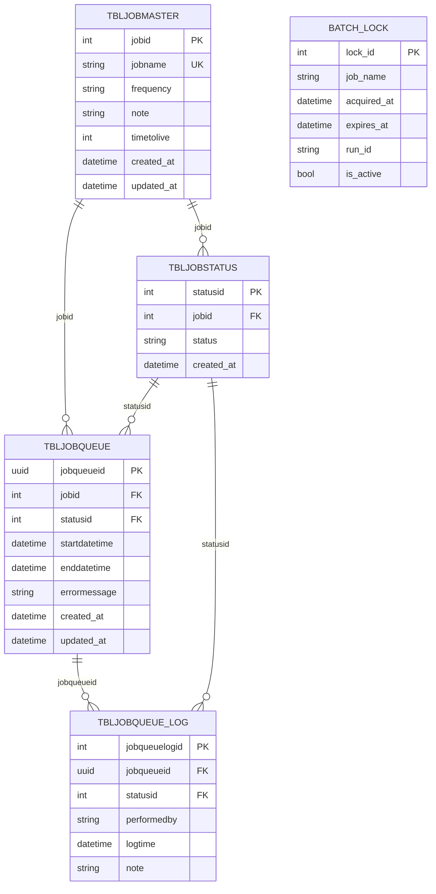

# Top 10 Q&A for Apha.BatchJobs Solution

## 1. What is the overall purpose of this BatchJobs solution?
It provides a production-ready batch processing foundation with two main runtimes: an API for job status/trigger operations and a Worker for actual job execution. The Application, Domain, and Infrastructure layers separate orchestration logic, business contracts, and persistence concerns.

## 2. What are the main projects and responsibilities?
- **Apha.BatchJobs.Api**: Exposes endpoints to check job status and trigger runs.
- **Apha.BatchJobs.Worker**: Executes jobs and manages lifecycle/exit behavior.
- **Apha.BatchJobs.Application**: Orchestration, job handlers, factory, and DI setup.
- **Apha.BatchJobs.Domain**: Shared entities, enums, interfaces, and settings models.
- **Apha.BatchJobs.Infrastructure**: EF Core context and repository implementations.
- **Apha.BatchJobs.UnitTests**: Coverage for orchestration, factory, mappings, controller triggers, and repository behavior.

## 3. How do I run it quickly on a local machine?
Build the solution and run local validation scripts. Typical path is to build `BatchJobs.sln` and then use `test-locally.ps1` (Windows) or `test-locally.sh` (Linux/macOS). For containerized local runs, use docker-compose profiles `withdb` (includes PostgreSQL) or `nodb` (in-memory flow).

## 4. What execution modes are supported?
- **Demo mode**: No database required; in-memory lock/execution repositories are used.
- **Development/Production mode**: PostgreSQL-backed repositories are used, with retry-capable EF Core configuration.

The mode is selected by `ASPNETCORE_ENVIRONMENT`.

## 5. Which jobs are currently available out of the box?
The codebase currently contains handlers for:
- `HealthCheck`
- `ScheduleJobs`
- `FECProcess`
- `RecreateSummaries`

Jobs are discovered via DI as `IBatchJob` implementations and resolved by name through the batch job factory.

Planned (not yet finalized/implemented):

- Scheduled job candidate name: `MABArchives` (name to be improved/finalized).

## 6. How does a job run from start to finish?
The orchestrator performs a full lifecycle:
1. Generate `RunId`
2. Acquire distributed lock
3. Write execution start record
4. Execute with controlled retry rules for transient errors
5. Write final status
6. Release lock

If lock acquisition fails, the run is marked as skipped instead of causing duplicate concurrent execution.

## 7. How can UI or external callers interact with jobs through the API?
The API provides endpoints under `api/batch-jobs` to:
- List all job statuses
- Get a specific job status
- Check whether a job can run
- Trigger a job run asynchronously

Trigger returns **202 Accepted** on success and **409 Conflict** if the job is already running, enabling clean UI polling and state control.

## 8. How is concurrency and duplicate execution prevented?
A lock repository enforces one active run per job. The orchestrator attempts lock acquisition before execution. If another process holds the lock, the new attempt is safely skipped. There is also lock expiry behavior as a fallback when release cannot be completed normally.

## 9. What are the worker exit codes and why do they matter?
The worker uses explicit semantic exit codes, including:
- `0`: success
- `1`: business/runtime failure
- `2`: configuration error
- `3`: cancelled
- `4`: skipped (lock contention)
- `5`: dependency outage

These allow container orchestration and monitoring systems to classify failures and trigger correct remediation.

## 10. What are the top operational prerequisites and common failure points?
**Required inputs**:
- `ASPNETCORE_ENVIRONMENT`
- `BATCH_JOB_NAME`
- `ConnectionStrings__FPSConnectionString` (database mode)

**For API-triggered ECS runs**:
- `Ecs:Cluster`
- `Ecs:TaskDefinition`
- `Ecs:ContainerName`
- `Ecs:Subnets` (at least one)
- Optional security/public IP settings

**Common issues**:
- Unknown job names
- Incomplete ECS configuration
- Invalid DB connectivity

**Recommended checks**:
- Verify registered job name
- Validate environment values
- Validate DB host/port/credentials
- Use database scripts for schema apply/reset in development

## 11. What is AWS Fargate, AWS EventBridge, and AWS ECS?
- **AWS ECS (Elastic Container Service)** is the container orchestration service. It manages where and how your containers run, scale, and restart.
- **AWS Fargate** is the serverless compute engine for containers used by ECS. With Fargate, you do not manage EC2 servers; you only define CPU, memory, networking, and the task to run.
- **AWS EventBridge** is an event bus and scheduler. It can trigger workloads on a schedule or in response to events, including starting ECS tasks.

In this BatchJobs solution, ECS is used to run worker tasks, Fargate is the launch type for those tasks, and EventBridge is used in the AWS PoC setup to trigger scheduled executions.

## 12. What is the difference between AWS Lambda and AWS Fargate?
- **AWS Lambda** runs code as short-lived functions. You deploy function code, and AWS manages runtime, scaling, and infrastructure. Best for event-driven tasks with quick execution and minimal container control.
- **AWS Fargate** runs full containers (via ECS or EKS) without managing servers. You control the container image, runtime dependencies, CPU/memory sizing, and task networking.

**Key differences**:
- **Packaging model**: Lambda uses functions; Fargate uses container images.
- **Runtime control**: Lambda is opinionated/limited; Fargate gives broader OS/runtime dependency control.
- **Execution profile**: Lambda is ideal for short, bursty tasks; Fargate is better for longer-running or heavier workloads.
- **Operational fit**: Lambda is simpler for small event handlers; Fargate is better when you already have containerized workers and need predictable container behavior.

For this BatchJobs solution, **Fargate is usually the better fit** because the worker is a containerized batch runtime with explicit job orchestration, environment-driven configuration, and infrastructure-level execution control.

## 13. Consolidated API Endpoints, Tables, and Logic

Current API surface with purpose, data interaction, and runtime behavior in one view.

**Database tables used in database mode**:
- `operational.tbljobmaster`
- `operational.tbljobstatus`
- `operational.tbljobqueue`
- `operational.tbljobqueue_log`
- `operational.batch_lock`

**Demo/NoDb mode note**: in-memory repositories are used, so database tables are not used.

1. **GET `api/batch-jobs`**
- **Description**: Returns current status of all registered batch jobs.
- **Purpose**: Populate dashboard/job list and provide overall system view.
- **Tables read**: `operational.batch_lock`, `operational.tbljobqueue`, `operational.tbljobmaster`, `operational.tbljobstatus`
- **Logic**: Enumerate registered jobs; for each job, fetch active lock and latest execution snapshot.
- **Small pseudocode**:
```text
GetAllStatuses():
	jobs = GetRegisteredJobs()
	return jobs.map(job => {
		lock = GetActiveLock(job)
		last = GetLastExecution(job)
		return BuildStatus(job, lock, last)
	})
```

2. **GET `api/batch-jobs/{jobName}/status`**
- **Description**: Returns status for one specific job.
- **Purpose**: Verify a single job state before manual action.
- **Tables read**: `operational.batch_lock`, `operational.tbljobqueue`, `operational.tbljobmaster`, `operational.tbljobstatus`
- **Logic**: Derive `IsRunning` from active lock; return latest queue/status record for last execution.
- **Small pseudocode**:
```text
GetStatus(jobName):
	lock = SELECT active lock by jobName
	last = SELECT latest execution by jobName
	return { isRunning: lock != null, activeLock: lock, lastExecution: last }
```

3. **GET `api/batch-jobs/{jobName}/can-run`**
- **Description**: Lightweight pre-check to decide trigger eligibility.
- **Purpose**: Enable/disable trigger button and avoid duplicate execution.
- **Tables read**: Same as status endpoint.
- **Logic**: Reuses status check; returns `canRun=false` when active lock exists, otherwise `canRun=true`.
- **Small pseudocode**:
```text
CanRun(jobName):
	status = GetStatus(jobName)
	if status.isRunning:
		return { canRun: false, reason: "Job is already running" }
	return { canRun: true }
```

4. **POST `api/batch-jobs/{jobName}/trigger`**
- **Description**: Validates state and dispatches asynchronous run request.
- **Purpose**: Start ad-hoc execution with accepted/polling pattern.
- **Tables read (API pre-check)**: same status-check tables above.
- **Tables written (worker execution flow)**: `operational.batch_lock`, `operational.tbljobmaster` (ensure), `operational.tbljobstatus` (ensure), `operational.tbljobqueue`, `operational.tbljobqueue_log`
- **Logic**: API checks not-running and dispatches ECS task; worker acquires lock, writes start and status logs, executes, updates final status, and releases lock.
- **Small pseudocode**:
```text
Trigger(jobName):
	status = GetStatus(jobName)
	if status.isRunning:
		return 409 Conflict

	taskArn = DispatchEcsTask(jobName)
	return 202 Accepted(taskArn)

Worker(jobName):
	runId = NewGuid()
	if !TryAcquireLock(jobName, runId): return Skipped
	WriteStartRows(tbljobmaster, tbljobstatus, tbljobqueue, tbljobqueue_log)
	ExecuteJobWithRetry()
	WriteFinalRows(tbljobstatus, tbljobqueue, tbljobqueue_log)
	ReleaseLock(jobName, runId)
```

5. **GET `/health`**
- **Description**: Returns lightweight health payload with status and UTC timestamp.
- **Purpose**: Liveness/readiness checks for load balancers and orchestrators.
- **Tables read/write**: none.
- **Logic**: Process-level health response only.
- **Small pseudocode**:
```text
Health():
  return { status: "healthy", timestamp: UtcNow }
```

## 14. Service and Task Relationship (API Example)

In ECS, a Service manages Task instances for a long-running workload.

- Service: Desired-state controller. It keeps N tasks running for a task definition.
- Task: One running instance of that task definition (a single execution unit).

How this applies to BatchJobs API:

1. The API is deployed as an ECS Service (for example: defra-poc-batchjobs-api-svc).
2. That Service points to an API task definition and desired count (for example: 1).
3. ECS starts one API Task from that definition.
4. If the API Task stops/crashes, the Service launches a replacement Task.
5. Result: the API endpoint stays continuously available.

How the worker differs:

- Worker jobs are usually run as standalone Tasks, not as a continuously running Service.
- A worker Task can be started by:
	- API trigger (RunTask)
	- EventBridge schedule
- Each run is a separate Task execution.

Small pseudocode (relationship):
```text
API Service Loop:
	desiredCount = 1
	while true:
		running = CountRunningTasks(apiTaskDefinition)
		if running < desiredCount:
			StartTask(apiTaskDefinition)

Manual Trigger Flow:
	user/ui -> call FPS API
	fps api -> POST /api/batch-jobs/{jobName}/trigger (BatchJobs API)
	batchjobs api task -> ecs:RunTask(workerTaskDefinition, env: BATCH_JOB_NAME=jobName)
	worker task -> execute job -> stop
```

Simple flow diagram:
```text
User/UI
	|
	| business request
	v
FPS API (backend entrypoint)
	|
	| HTTP POST /api/batch-jobs/{jobName}/trigger
	v
ECS Service: defra-poc-batchjobs-api-svc (desiredCount=1)
	|
	| keeps API Task running continuously
	v
API Task (Apha.BatchJobs.Api container)
	|
	| calls ECS RunTask for worker
	v
Worker Task (Apha.BatchJobs.Worker container)
	|
	| acquires lock -> runs job -> writes status/logs -> releases lock
	v
PostgreSQL (operational.* tables) + CloudWatch logs

Optional scheduled path:
EventBridge Schedule -> ECS RunTask -> Worker Task
```

## 15. Stored ECS API Task Definition Snapshot

Stored on 2026-04-28 from your provided payload. Password is redacted for security.

```json
{
	"taskDefinitionArn": "arn:aws:ecs:us-east-1:837071794782:task-definition/defra-poc-batchjobs-api:8",
	"containerDefinitions": [
		{
			"name": "batchjobs-api",
			"image": "837071794782.dkr.ecr.us-east-1.amazonaws.com/poc/defra_batchjob_api:latest",
			"cpu": 0,
			"portMappings": [
				{
					"containerPort": 8080,
					"hostPort": 8080,
					"protocol": "tcp"
				}
			],
			"essential": true,
			"environment": [
				{
					"name": "ASPNETCORE_ENVIRONMENT",
					"value": "Production"
				},
				{
					"name": "Ecs__SecurityGroups__0",
					"value": "sg-0a3eacdef2802ad54"
				},
				{
					"name": "Ecs__Subnets__1",
					"value": "subnet-0352624cceaee0316"
				},
				{
					"name": "Ecs__Subnets__2",
					"value": "subnet-03cfb3a5727a0a6e1"
				},
				{
					"name": "Ecs__Subnets__3",
					"value": "subnet-07088d8e0e108ce32"
				},
				{
					"name": "Ecs__ContainerName",
					"value": "batchjobs-worker"
				},
				{
					"name": "Ecs__Subnets__4",
					"value": "subnet-09ed76a302801f6a1"
				},
				{
					"name": "Ecs__TaskDefinition",
					"value": "defra-poc-batchjobs-worker"
				},
				{
					"name": "ASPNETCORE_URLS",
					"value": "http://+:8080"
				},
				{
					"name": "ConnectionStrings__FPSConnectionString",
					"value": "Host=defra-poc-batchjobs-postgres.crgf0knajwzv.us-east-1.rds.amazonaws.com;Port=5432;Database=batchjobs;Username=postgres;Password=<REDACTED>;SSL Mode=Require;Trust Server Certificate=true"
				},
				{
					"name": "Ecs__AssignPublicIp",
					"value": "true"
				},
				{
					"name": "Ecs__Subnets__0",
					"value": "subnet-02ff851128ca86ee2"
				},
				{
					"name": "Ecs__Cluster",
					"value": "defra-poc-batchjobs-cluster"
				}
			],
			"mountPoints": [],
			"volumesFrom": [],
			"logConfiguration": {
				"logDriver": "awslogs",
				"options": {
					"awslogs-group": "/ecs/defra-poc-batchjobs-api",
					"awslogs-region": "us-east-1",
					"awslogs-stream-prefix": "ecs"
				}
			},
			"systemControls": []
		}
	],
	"family": "defra-poc-batchjobs-api",
	"taskRoleArn": "arn:aws:iam::837071794782:role/defra-poc-api-task-role",
	"executionRoleArn": "arn:aws:iam::837071794782:role/defra-poc-ecs-task-execution-role",
	"networkMode": "awsvpc",
	"revision": 8,
	"volumes": [],
	"status": "ACTIVE",
	"requiresAttributes": [
		{
			"name": "com.amazonaws.ecs.capability.logging-driver.awslogs"
		},
		{
			"name": "ecs.capability.execution-role-awslogs"
		},
		{
			"name": "com.amazonaws.ecs.capability.ecr-auth"
		},
		{
			"name": "com.amazonaws.ecs.capability.docker-remote-api.1.19"
		},
		{
			"name": "com.amazonaws.ecs.capability.task-iam-role"
		},
		{
			"name": "ecs.capability.execution-role-ecr-pull"
		},
		{
			"name": "com.amazonaws.ecs.capability.docker-remote-api.1.18"
		},
		{
			"name": "ecs.capability.task-eni"
		}
	],
	"placementConstraints": [],
	"compatibilities": [
		"EC2",
		"MANAGED_INSTANCES",
		"FARGATE"
	],
	"requiresCompatibilities": [
		"FARGATE"
	],
	"cpu": "512",
	"memory": "1024",
	"registeredAt": "2026-04-27T11:10:48.645Z",
	"registeredBy": "arn:aws:iam::837071794782:user/arihant.jain@atos.net",
	"tags": []
}
```

## 16. Relationship Between ECS, Cluster, Service, and Task

They are related (hierarchical), not independent.

1. **ECS**: The container orchestration platform.
2. **Cluster**: A logical boundary inside ECS where workloads run.
3. **Task**: One running execution unit of a task definition.
4. **Service**: A controller that keeps a desired number of tasks running.

Hierarchy:

```text
ECS -> Cluster -> Tasks
ECS -> Cluster -> Service -> Tasks
```

How this maps to BatchJobs:

- Cluster: `defra-poc-batchjobs-cluster`
- API: runs as a **Service** (`defra-poc-batchjobs-api-svc`) that maintains API **Task** instances.
- Worker: runs as on-demand or scheduled **Task** executions in the same cluster.

Small pseudocode:

```text
platform = ECS
cluster = "defra-poc-batchjobs-cluster"

apiService(desiredCount=1) -> keeps apiTasks running
trigger/schedule -> starts workerTask in cluster -> workerTask completes and stops
```

## 17. UI Button Flows and Status/Progress Handling

### A. Recreate Summaries button flow

1. User clicks **Recreate Summaries** in UI.
2. UI calls **FPS API** (backend entrypoint).
3. FPS API calls BatchJobs API: `POST /api/batch-jobs/RecreateSummaries/trigger`.
4. BatchJobs API checks current status:
	 - If already running: returns `409 Conflict`.
	 - If not running: returns `202 Accepted` and dispatches ECS RunTask.
5. Worker task starts with `BATCH_JOB_NAME=RecreateSummaries`, runs, writes status/logs, and ends.

### B. FEC Process button flow

Same pipeline, different job name.

1. User clicks **FEC Process**.
2. UI -> FPS API -> BatchJobs API trigger call: `POST /api/batch-jobs/FECProcess/trigger`.
3. BatchJobs API returns `409` (already running) or `202` (accepted).
4. Worker task runs with `BATCH_JOB_NAME=FECProcess`.

### C. How UI gets status back while job is running

Use polling against BatchJobs API endpoints.

- Pre-check endpoint: `GET /api/batch-jobs/{jobName}/can-run`
- Detailed status endpoint: `GET /api/batch-jobs/{jobName}/status`

Recommended UI behavior:

1. On page load, call `can-run`.
2. If `canRun=false`, disable trigger button and show reason.
3. After trigger returns `202`, start polling `status` every 5 to 10 seconds.
4. While `IsRunning=true`, show running state using `ActiveLock.RunId`, `AcquiredAt`, `ExpiresAt`.
5. When `IsRunning=false`, read `LastExecution.Status` and stop polling.

### D. What "progress" means in current API

Current API provides **state-based progress**, not percentage progress.

- Available now:
	- Running or not: `IsRunning`
	- Current run context: `ActiveLock` (runId/timestamps)
	- Last run outcome: `LastExecution.Status`, `StartedAt`, `CompletedAt`
- Not available now:
	- Step-by-step completion percentage (for example 0-100%)
	- Current pipeline stage name from within job logic

So the UI should show progress as phases:

- `Idle` -> `Accepted` -> `Running` -> `Completed/Failed/Cancelled/Skipped`

Small pseudocode (UI polling model):

```text
OnButtonClick(jobName):
	resp = FPS_API.Trigger(jobName)
	if resp.status == 409:
		Show("Already running")
		DisableButton(jobName)
		return

	if resp.status == 202:
		SetUiState(jobName, "Accepted")
		StartPolling(jobName)

StartPolling(jobName):
	every 5-10 seconds:
		s = FPS_API.GetJobStatus(jobName)
		if s.isRunning:
			SetUiState(jobName, "Running")
			ShowRunInfo(s.activeLock.runId, s.activeLock.acquiredAt, s.activeLock.expiresAt)
		else:
			SetUiState(jobName, s.lastExecution.status)
			StopPolling(jobName)
```

## 18. Stored ECS Worker Task Definition Snapshot

Stored on 2026-04-28 from your provided payload. Password is redacted for security.

```json
{
	"taskDefinitionArn": "arn:aws:ecs:us-east-1:837071794782:task-definition/defra-poc-batchjobs-worker:8",
	"containerDefinitions": [
		{
			"name": "batchjobs-worker",
			"image": "837071794782.dkr.ecr.us-east-1.amazonaws.com/poc/defra_batchjob:latest",
			"cpu": 0,
			"portMappings": [],
			"essential": true,
			"environment": [
				{
					"name": "ASPNETCORE_ENVIRONMENT",
					"value": "Production"
				},
				{
					"name": "ConnectionStrings__FPSConnectionString",
					"value": "Host=defra-poc-batchjobs-postgres.crgf0knajwzv.us-east-1.rds.amazonaws.com;Port=5432;Database=batchjobs;Username=postgres;Password=<REDACTED>;SSL Mode=Require;Trust Server Certificate=true"
				}
			],
			"mountPoints": [],
			"volumesFrom": [],
			"logConfiguration": {
				"logDriver": "awslogs",
				"options": {
					"awslogs-group": "/ecs/defra-poc-batchjobs-worker",
					"awslogs-region": "us-east-1",
					"awslogs-stream-prefix": "ecs"
				}
			},
			"systemControls": []
		}
	],
	"family": "defra-poc-batchjobs-worker",
	"taskRoleArn": "arn:aws:iam::837071794782:role/defra-poc-batch-task-role",
	"executionRoleArn": "arn:aws:iam::837071794782:role/defra-poc-ecs-task-execution-role",
	"networkMode": "awsvpc",
	"revision": 8,
	"volumes": [],
	"status": "ACTIVE",
	"requiresAttributes": [
		{
			"name": "com.amazonaws.ecs.capability.logging-driver.awslogs"
		},
		{
			"name": "ecs.capability.execution-role-awslogs"
		},
		{
			"name": "com.amazonaws.ecs.capability.ecr-auth"
		},
		{
			"name": "com.amazonaws.ecs.capability.docker-remote-api.1.19"
		},
		{
			"name": "com.amazonaws.ecs.capability.task-iam-role"
		},
		{
			"name": "ecs.capability.execution-role-ecr-pull"
		},
		{
			"name": "com.amazonaws.ecs.capability.docker-remote-api.1.18"
		},
		{
			"name": "ecs.capability.task-eni"
		}
	],
	"placementConstraints": [],
	"compatibilities": [
		"EC2",
		"FARGATE",
		"MANAGED_INSTANCES"
	],
	"requiresCompatibilities": [
		"FARGATE"
	],
	"cpu": "512",
	"memory": "1024",
	"registeredAt": "2026-04-27T11:10:59.012Z",
	"registeredBy": "arn:aws:iam::837071794782:user/arihant.jain@atos.net",
	"tags": []
}
```

## 19. Stored Environment Variables Reference

Stored on 2026-04-28 from your provided values. Password is redacted for security.

```text
Environment variables (2)

ASPNETCORE_ENVIRONMENT=Production

ConnectionStrings__FPSConnectionString=Host=defra-poc-batchjobs-postgres.crgf0knajwzv.us-east-1.rds.amazonaws.com;Port=5432;Database=batchjobs;Username=postgres;Password=<REDACTED>;SSL Mode=Require;Trust Server Certificate=true
```

## 20. Stored Environment Variables Reference (13)

Stored on 2026-04-28 from your provided values. Password is redacted for security.

```text
Environment variables (13)

ASPNETCORE_ENVIRONMENT=Production
ASPNETCORE_URLS=http://+:8080
ConnectionStrings__FPSConnectionString=Host=defra-poc-batchjobs-postgres.crgf0knajwzv.us-east-1.rds.amazonaws.com;Port=5432;Database=batchjobs;Username=postgres;Password=<REDACTED>;SSL Mode=Require;Trust Server Certificate=true
Ecs__AssignPublicIp=true
Ecs__Cluster=defra-poc-batchjobs-cluster
Ecs__ContainerName=batchjobs-worker
Ecs__SecurityGroups__0=sg-0a3eacdef2802ad54
Ecs__Subnets__0=subnet-02ff851128ca86ee2
Ecs__Subnets__1=subnet-0352624cceaee0316
Ecs__Subnets__2=subnet-03cfb3a5727a0a6e1
Ecs__Subnets__3=subnet-07088d8e0e108ce32
Ecs__Subnets__4=subnet-09ed76a302801f6a1
Ecs__TaskDefinition=defra-poc-batchjobs-worker
```

## 21. EcsTaskDispatcher Config Keys and How They Drive RunTask

In `EcsTaskDispatcher.RunBatchJobAsync`, these values are read from configuration and used to construct the ECS `RunTaskRequest`.

Read from config:

- `Ecs:Cluster` -> target ECS cluster.
- `Ecs:TaskDefinition` -> worker task definition family/revision to run.
- `Ecs:ContainerName` -> container inside task definition that receives env overrides.
- `Ecs:Subnets` -> awsvpc subnet list for task ENI placement.
- `Ecs:SecurityGroups` -> security groups attached to the task ENI.
- `Ecs:AssignPublicIp` -> whether to assign a public IP (`ENABLED`/`DISABLED`).

How they map into `RunTaskRequest`:

```text
request.Cluster = Ecs:Cluster
request.TaskDefinition = Ecs:TaskDefinition
request.LaunchType = FARGATE

request.NetworkConfiguration.AwsvpcConfiguration.Subnets = Ecs:Subnets
request.NetworkConfiguration.AwsvpcConfiguration.SecurityGroups = Ecs:SecurityGroups
request.NetworkConfiguration.AwsvpcConfiguration.AssignPublicIp = Ecs:AssignPublicIp

request.Overrides.ContainerOverrides[0].Name = Ecs:ContainerName
request.Overrides.ContainerOverrides[0].Environment +=
	BATCH_JOB_NAME = {jobName}
	BATCH_RUN_MODE = Manual
```

Validation behavior:

- If `Cluster`, `TaskDefinition`, or `ContainerName` is missing/blank, trigger fails fast with configuration error.
- If `Subnets` is empty, trigger fails fast because Fargate + `awsvpc` requires at least one subnet.

Important runtime note:

- The image URI is not read from these keys.
- ECS gets image URI from the referenced task definition's `containerDefinitions[].image` (already registered in ECS).

## 22. What `RunTaskAsync` Does (Build-Up and Execution)

Code line:

```csharp
var response = await _ecs.RunTaskAsync(request, cancellationToken);
```

### A. Build-up before this call

1. Validate input job name (`jobName` must not be empty).
2. Read ECS runtime config:
	 - `Ecs:Cluster`
	 - `Ecs:TaskDefinition`
	 - `Ecs:ContainerName`
	 - `Ecs:Subnets`
	 - `Ecs:SecurityGroups`
	 - `Ecs:AssignPublicIp`
3. Fail fast if required config is missing.
4. Build `RunTaskRequest` with:
	 - `Cluster`
	 - `TaskDefinition`
	 - `LaunchType = FARGATE`
	 - `Count = 1`
	 - `awsvpc` network config (subnets, security groups, public IP)
	 - container overrides:
		 - `BATCH_JOB_NAME = {jobName}`
		 - `BATCH_RUN_MODE = Manual`

### B. What this call does in AWS

When `RunTaskAsync` is called, ECS control plane:

1. Accepts the run request in the target cluster.
2. Resolves task definition family/revision.
3. Uses task definition container image (`containerDefinitions[].image`).
4. Starts one Fargate task with requested networking.
5. Applies container env overrides from the request.

Important:

- This call confirms **launch request outcome**, not job completion outcome.
- Job success/failure is determined later by worker execution and status polling.

### C. How response is handled in this code

1. If `response.Failures` contains entries:
	 - Build failure text, log error, throw exception.
2. Else read `response.Tasks[0].TaskArn`.
3. If no task ARN exists, throw exception.
4. Return task ARN as operation identifier to caller.

Small pseudocode:

```text
response = ECS.RunTask(request)

if response.failures.any():
	log error
	throw

taskArn = first(response.tasks).taskArn
if empty(taskArn):
	throw

return taskArn
```

## 23. Trigger Strategy: API + EventBridge (and S3 Alternative)

### Recommended model used in this solution

1. **Manual/ad-hoc trigger path**:
	- UI -> FPS API -> BatchJobs API -> ECS `RunTask`
2. **Scheduled trigger path**:
	- EventBridge rule -> ECS `RunTask`
3. **Shared execution safety**:
	- Both paths run the same worker/orchestrator lock logic to avoid duplicate overlap.

Why this split works well:

- EventBridge is purpose-built for scheduled cron/rate execution.
- API trigger is best for user-driven actions and immediate UI feedback (`202`, `409`, status polling).
- One worker task definition can serve both paths with different runtime overrides.

### S3 trigger option (possible but not needed here)

Possible pattern:

- Upload marker file to S3 -> S3 event -> EventBridge/Lambda -> ECS `RunTask`.

Why we do **not** need S3 trigger for current button-based jobs:

1. Your trigger is command-driven (button click), not file-arrival-driven.
2. API path already provides better synchronous UX:
	- quick accept/conflict response
	- clear pre-check and status polling model
3. S3-based trigger adds extra components and operational overhead (bucket event rules, Lambda/EventBridge glue, duplicate event handling, object lifecycle/cleanup).
4. Correlation and observability are simpler in direct API/EventBridge paths than file-marker indirection.

When S3 trigger is appropriate:

- If business event is truly "new file arrived" and processing should start automatically based on object creation.

## 24. ER Diagram and Sample Data (Operational Tables)

### ER diagram



### Relationship summary

- One job (`tbljobmaster`) can have many status values (`tbljobstatus`).
- One job (`tbljobmaster`) can have many executions (`tbljobqueue`).
- One status (`tbljobstatus`) can be referenced by many queue rows (`tbljobqueue`).
- One execution (`tbljobqueue`) can have many audit entries (`tbljobqueue_log`).
- `batch_lock` is lock-state storage keyed by job name (active lock per job), not a foreign-key child table.

### Sample data (one run lifecycle)

`operational.tbljobmaster`

| jobid | jobname | frequency | note | timetolive |
|---|---|---|---|---|
| 2 | RecreateSummaries | null | Auto-created by worker runtime | 3600 |

`operational.tbljobstatus`

| statusid | jobid | status |
|---|---|---|
| 10 | 2 | Running |
| 11 | 2 | Completed |
| 12 | 2 | Failed |

`operational.tbljobqueue`

| jobqueueid | jobid | statusid | startdatetime | enddatetime | errormessage |
|---|---|---|---|---|---|
| a4a7de4a-2c1f-4bde-9755-8f4f11d0a919 | 2 | 11 | 2026-04-28T09:15:03Z | 2026-04-28T09:17:20Z | null |

`operational.tbljobqueue_log`

| jobqueuelogid | jobqueueid | statusid | performedby | logtime | note |
|---|---|---|---|---|---|
| 101 | a4a7de4a-2c1f-4bde-9755-8f4f11d0a919 | 10 | BatchWorker | 2026-04-28T09:15:03Z | Execution started |
| 102 | a4a7de4a-2c1f-4bde-9755-8f4f11d0a919 | 11 | BatchWorker | 2026-04-28T09:17:20Z | Execution completed |

`operational.batch_lock` (active only while running)

| lock_id | job_name | run_id | acquired_at | expires_at | is_active |
|---|---|---|---|---|---|
| 57 | RecreateSummaries | a4a7de4a2c1f4bde97558f4f11d0a919 | 2026-04-28T09:15:03Z | 2026-04-28T10:15:03Z | false |

Small pseudocode (table write order):

```text
on worker start(jobName, runId):
  ensure tbljobmaster row for jobName
  ensure tbljobstatus row for "Running"
  insert tbljobqueue(runId, status=Running)
  insert tbljobqueue_log(note="Execution started")
  insert/activate batch_lock(job_name=jobName, run_id=runId)

on worker finish(runId, outcome):
  ensure tbljobstatus row for outcome
  update tbljobqueue(status=outcome, enddatetime, errormessage)
  insert tbljobqueue_log(note=outcome note)
  release/deactivate batch_lock(job_name)
```

## 25. Why `BATCH_JOB_NAME` is Passed as Environment Override (Not Arguments)

In this solution, using environment override is intentional and preferable.

### Why environment override is used

1. **Aligned with worker runtime pattern**
	- Worker resolves job context from runtime configuration, and env variables are already part of that model.
2. **No command/entrypoint override needed**
	- Passing args often requires ECS `ContainerOverride.Command` changes.
	- Env override avoids coupling trigger logic to container entrypoint details.
3. **Consistent across manual and scheduled triggers**
	- API-trigger path and EventBridge scheduled path can both set the same env keys.
4. **Operationally simpler and less brittle**
	- No positional argument issues, quoting issues, or command parsing drift.
5. **Reusable task definition/image**
	- Same worker task definition can execute different jobs by changing only env values.

### Why not command arguments in current design

- Would require explicit command override management in ECS request payload.
- More tightly coupled to image startup command and Docker entrypoint behavior.
- Higher maintenance risk when container startup contract changes.

### When arguments can still make sense

- If the app is intentionally CLI-first with a stable command contract.
- If strict positional argument invocation is a deliberate design choice.

### Conclusion for this BatchJobs solution

For your API + EventBridge dual-trigger model, env override (`BATCH_JOB_NAME`, `BATCH_RUN_MODE`) is the more robust and maintainable approach.

## 26. BatchWorker End-to-End Flow (with DB Involvement)

This section describes the full worker lifecycle from trigger to completion and explicitly shows where database operations happen.

### A. End-to-end sequence

1. Trigger comes from either path:
	 - Manual: UI -> FPS API -> BatchJobs API -> ECS `RunTask`
	 - Scheduled: EventBridge -> ECS `RunTask`
2. ECS/Fargate starts the worker container with env overrides (`BATCH_JOB_NAME`, `BATCH_RUN_MODE`).
3. Worker host starts and resolves target job name.
4. Worker invokes `JobOrchestrator.RunAsync(jobName, runMode)`.
5. Orchestrator generates `runId`.
6. Orchestrator attempts distributed lock acquisition.
	 - DB involved: `operational.batch_lock` (insert active lock)
	 - If lock not acquired: return `Skipped`.
7. Orchestrator creates execution-start record.
	 - DB involved:
		 - ensure `operational.tbljobmaster` row for job
		 - ensure `operational.tbljobstatus` row for `Running`
		 - insert `operational.tbljobqueue` (start row)
		 - insert `operational.tbljobqueue_log` ("Execution started")
8. Orchestrator resolves and executes the job handler from factory.
	 - Job-specific business logic runs here.
9. On completion/failure/cancel, orchestrator updates final execution state.
	 - DB involved:
		 - ensure `operational.tbljobstatus` row for final status (`Completed`/`Failed`/`Cancelled`)
		 - update `operational.tbljobqueue` (final status, end time, error)
		 - insert `operational.tbljobqueue_log` (final note)
10. Orchestrator releases lock.
		- DB involved: remove/deactivate row in `operational.batch_lock`
11. Worker exits with semantic code (`0/1/2/3/4/5`) and logs summary.

### B. Flow diagram

```text
Trigger Source
	|- Manual: UI -> FPS API -> BatchJobs API
	|- Scheduled: EventBridge
	v
ECS RunTask (worker task definition)
	v
Fargate starts BatchWorker container
	v
Program.cs -> JobOrchestrator.RunAsync(jobName, runMode)
	v
[DB] TryAcquireLock -> operational.batch_lock
	|- lock not acquired -> SKIPPED -> exit code 4
	v
[DB] Create start execution records
	|- ensure tbljobmaster
	|- ensure tbljobstatus(Running)
	|- insert tbljobqueue(start)
	|- insert tbljobqueue_log(started)
	v
Execute job handler (HealthCheck / FECProcess / RecreateSummaries / ...)
	v
[DB] Write final execution records
	|- ensure tbljobstatus(final)
	|- update tbljobqueue(final)
	|- insert tbljobqueue_log(final)
	v
[DB] ReleaseLock -> operational.batch_lock
	v
Worker summary log + exit code
```

### C. Pseudocode (end-to-end)

```text
RunWorker(jobName, runMode):
	runId = NewGuid()

	# DB: operational.batch_lock
	if !TryAcquireLock(jobName, runId):
		return ExitCode.Skipped

	# DB: master/status/queue/log (start)
	jobId = EnsureJobMaster(jobName)                     # tbljobmaster
	runningStatusId = EnsureStatus(jobId, "Running")   # tbljobstatus
	InsertQueue(runId, jobId, runningStatusId, startNow) # tbljobqueue
	InsertQueueLog(runId, runningStatusId, "Execution started") # tbljobqueue_log

	try:
		ExecuteJobHandler(jobName, runMode)
		finalStatus = "Completed"
		error = null
	catch OperationCanceledException:
		finalStatus = "Cancelled"
		error = "Cancelled"
	catch Exception ex:
		finalStatus = "Failed"
		error = ex.Message
	finally:
		# DB: status/queue/log (final)
		finalStatusId = EnsureStatus(jobId, finalStatus)       # tbljobstatus
		UpdateQueue(runId, finalStatusId, endNow, error)       # tbljobqueue
		InsertQueueLog(runId, finalStatusId, FinalNote(error)) # tbljobqueue_log

		# DB: operational.batch_lock
		ReleaseLock(jobName, runId)

	return ExitCode.FromFinalStatus(finalStatus)
```

### D. What API/UI can observe from DB-backed status

- While running:
	- active lock exists in `operational.batch_lock`
	- latest queue row has `Running` status
- After completion:
	- lock removed/expired
	- latest queue row reflects final status and end time
	- queue log contains start and final status notes

## 27. Worker Exit Codes and What They Mean

Worker exit codes are defined in `Apha.BatchJobs.Worker/Program.cs` and are intended for clear operational signaling.

1. **`0` - Success**
	 - Job executed and completed successfully.

2. **`1` - Business/runtime failure**
	 - Unhandled non-dependency exception in job runtime/business logic.

3. **`2` - Configuration error**
	 - Configuration/registration issue (for example invalid job name/factory resolution failure).

4. **`3` - Cancelled**
	 - Execution cancelled due to host shutdown, cancellation token, or graceful-stop window behavior.

5. **`4` - Skipped (lock contention)**
	 - Job intentionally not run because another active run already holds the lock.
	 - This is treated as non-fatal overlap protection.

6. **`5` - Dependency outage**
	 - Failure classified as external dependency outage (for example DB/network/service unavailability).

Operational usage guidance:

- Treat `0` as success.
- Treat `4` as informational/non-fatal skip (retry later).
- Treat `1`, `2`, `3`, `5` as actionable signals with different remediation paths.

Small pseudocode (exit mapping):

```text
if result.Status == Skipped:
	return 4

if InvalidOperationException:
	return 2

if OperationCanceledException:
	return 3

if IsDependencyOutage(exception):
	return 5

if exception exists:
	return 1

return 0
```

## 28. Lock Logic and How It Is Maintained in DB

The worker uses a DB-backed distributed lock so only one active run per job can execute at a time.

### A. Lock storage model

- Lock table: `operational.batch_lock`
- Key fields:
	- `job_name`
	- `run_id`
	- `acquired_at`
	- `expires_at`
	- `is_active`

The DB enforces one active lock per job using a partial unique index:

- `uq_batch_lock_job_name_active` on `job_name` where `is_active = TRUE`

### B. Lock acquisition flow

1. Orchestrator calls lock repository before any job execution.
2. Repository first removes expired lock rows for that job.
3. Repository attempts to insert a new active lock row.
4. If insert succeeds, lock is acquired.
5. If insert hits PostgreSQL unique violation (`23505`), another run already holds the lock, so acquisition returns false.
6. Orchestrator then returns `Skipped` (no duplicate run).

### C. Lock release flow

1. In orchestrator `finally`, release is attempted always.
2. Repository finds lock row by `job_name + run_id`.
3. If found, row is removed and saved.
4. If not found, it logs and continues.

### D. Status API lock read

- Status service checks `GetActiveLockAsync(jobName)`.
- A lock is considered active only when:
	- `is_active = true`
	- `expires_at > now`

This drives UI behavior such as `IsRunning`, conflict-on-trigger, and can-run pre-check.

### E. Why this approach is robust

1. DB-level uniqueness prevents race conditions across concurrent trigger paths.
2. Expiration handles stale/orphaned locks if a worker dies before clean release.
3. `finally` release path minimizes lock leakage in normal execution.
4. Same lock mechanism protects both API-triggered and EventBridge-triggered runs.

Small pseudocode:

```text
TryAcquireLock(jobName, runId, timeout):
	delete from batch_lock where job_name=jobName and expires_at < now
	try insert (job_name, run_id, acquired_at, expires_at, is_active=true)
	catch unique_violation(23505): return false
	return true

RunAsync(jobName):
	if !TryAcquireLock(...): return Skipped
	try:
		execute job
	finally:
		ReleaseLock(jobName, runId)

GetActiveLock(jobName):
	return row where job_name=jobName and is_active=true and expires_at>now
```

## 29. What Is a Distributed Lock and Why It Is Needed

A distributed lock is a lock shared across multiple processes/instances by using a common external store (database, cache, etc.), so only one instance can enter a critical section at a time.

Why it is called distributed:

- Worker tasks run in separate ECS containers and can start concurrently.
- In-memory locks are local to one process only.
- Distributed lock coordinates execution across all worker instances.

Why this solution needs it:

1. Prevent duplicate concurrent runs of the same job.
2. Avoid data integrity issues and duplicated side effects.
3. Handle race conditions between manual trigger and scheduled trigger.
4. Keep UI/API behavior deterministic (`IsRunning`, `409 Conflict`, `canRun=false`).

How it maps here:

- Lock state is persisted in `operational.batch_lock`.
- Unique active lock per job is enforced by DB index.
- Acquire lock before execution, release in `finally`, and use expiration to recover from stale locks.

Simple mental model:

- Distributed lock acts as a global mutex per job name across all running worker tasks.

## 30. Program.cs, Orchestrator, Factory, and Jobs: How They Connect

This is the core runtime chain inside the worker.

### A. `Program.cs` (Worker entrypoint)

Responsibilities:

1. Build host and configuration (`appsettings*.json` + environment variables).
2. Configure logging (Serilog + structured console).
3. Register dependencies via `ConfigureServices()`.
4. Resolve `jobName` and `runMode` from args/env (`BATCH_JOB_NAME`, `BATCH_RUN_MODE`).
5. Start host and invoke orchestrator.
6. Map runtime outcomes to semantic exit codes.

Think of `Program.cs` as the runtime bootstrap and process supervisor.

### B. `ServiceCollectionSetup` (DI composition root)

Responsibilities:

1. Register settings (`BatchJobs` section).
2. Decide repository mode by environment:
	- Demo -> in-memory repositories
	- Non-Demo -> PostgreSQL repositories + EF Core `BatchJobsDbContext`
3. Discover and register all `IBatchJob` implementations via assembly scan.
4. Register:
	- `IBatchJobFactory -> BatchJobFactory`
	- `IJobOrchestrator -> JobOrchestrator`

Think of this as wiring all building blocks before execution starts.

### C. `JobOrchestrator` (execution lifecycle owner)

Responsibilities:

1. Generate `runId`.
2. Acquire distributed lock.
3. Create execution-start record.
4. Resolve job from factory and execute with retry policy.
5. Update final execution status.
6. Release lock in `finally`.

It centralizes cross-cutting concerns (locking, tracking, retries, cancellation), so job handlers stay focused on business logic.

### D. `BatchJobFactory` (job resolver)

Responsibilities:

1. Fetch all registered `IBatchJob` handlers from DI.
2. Match by `job.Name` (case-insensitive).
3. Enforce exactly one match:
	- none -> throw unknown job error
	- multiple -> throw duplicate registration error

This gives controlled and deterministic job resolution.

### E. Job Handlers (`IBatchJob` implementations)

Responsibilities:

1. Expose a stable `Name` used by trigger/factory.
2. Implement `ExecuteAsync()` with job-specific behavior.
3. Provide metadata (idempotency/schedule/timeout hints where applicable).

Current handlers include:

- `HealthCheck`
- `ScheduleJobs`
- `FECProcess`
- `RecreateSummaries`

### F. End-to-end call chain

```text
Program.cs
  -> resolve jobName/runMode
  -> IJobOrchestrator.RunAsync(jobName, runMode)
		-> TryAcquireLock
		-> CreateExecutionRecord(start)
		-> IBatchJobFactory.Create(jobName)
			 -> resolve concrete IBatchJob by Name
		-> job.ExecuteAsync()
		-> UpdateExecutionRecord(final)
		-> ReleaseLock
  -> map result/exception to exit code
```

### G. Why this structure is useful

1. Clear separation of concerns (bootstrap vs orchestration vs business logic).
2. New jobs can be added by implementing `IBatchJob` without changing orchestrator flow.
3. Shared reliability behavior (locking/retry/tracking/exit codes) remains consistent across all jobs.

## 31. If Different Jobs Belong to Different Domain APIs (FPS, PACT, etc.), Should Each API Implement Its Own ECS Trigger Logic?

Short answer: it works initially, but it is not the best long-term approach.

### A. What is acceptable now

If one domain API (for example FPS) currently triggers jobs and the code is stable, keeping that implementation is fine for immediate delivery.

### B. What becomes a problem over time

If each domain API (FPS, PACT, and future APIs) implements similar ECS trigger code independently, these issues usually appear:

1. Duplication of validation and `RunTask` request building.
2. Drift in retry, timeout, and error mapping behavior.
3. Inconsistent observability (logs, correlation IDs, operation IDs).
4. Repeated maintenance when ECS settings/contracts change.
5. Harder security governance (IAM policies and trigger permissions spread across many APIs).

### C. Recommended target design

Keep domain APIs as business entry points, but centralize batch trigger orchestration in one place.

Two good patterns:

1. **Dedicated Batch Trigger API/service**
	- Domain APIs call this internal service.
	- Service owns ECS integration, validation, idempotency, and response contract.

2. **Shared internal library/package**
	- All domain APIs use the same reusable trigger component.
	- Faster to adopt when introducing a separate service is not feasible yet.

### D. Suggested contract for consistency

Use one standard request/response shape across all callers.

Request example fields:

- `jobName`
- `requestedBy`
- `correlationId`
- `sourceSystem`
- optional payload/parameters

Response behavior should remain consistent:

- `202 Accepted` when run request is launched.
- `409 Conflict` when lock/status indicates active run.
- Deterministic error mapping for configuration/dependency failures.

### E. Important reliability note

Keep duplicate-run protection in worker/orchestrator lock logic (already implemented). Trigger-side checks are useful for UX, but lock enforcement in worker remains the source of truth.

### F. Practical migration path

1. Keep current FPS path running as-is.
2. Extract ECS dispatch + config validation + telemetry into reusable component.
3. Use the same component from PACT and future domain APIs.
4. Optionally move to a dedicated internal Batch Trigger service later.

Small pseudocode (target pattern):

```text
Domain API (FPS/PACT/Other)
	-> Validate domain intent/authorization
	-> Call BatchTriggerGateway.Trigger(jobName, correlationId, requestedBy)
	-> Return standardized 202/409/error response

BatchTriggerGateway (shared service/library)
	-> Validate trigger config
	-> Build ECS RunTask request
	-> Apply env overrides (BATCH_JOB_NAME, BATCH_RUN_MODE)
	-> Execute RunTask
	-> Return taskArn + operation metadata
```

## 32. If API Access Is Public via FPS API, What Cloud Configuration Impacts Should Be Captured?

When trigger capability moves into FPS API (publicly reachable API tier), keep worker tasks private and explicitly tighten ECS/network controls.

### A. Target network model

1. **Public entry only at API layer**
	- FPS API is internet-facing (typically via ALB/API Gateway/Ingress).
	- Batch worker tasks should remain non-public.
2. **Private execution for workers**
	- Keep worker tasks in private subnets.
	- Prefer `AssignPublicIp=DISABLED` for worker task runs unless there is a strict dependency requiring outbound direct internet.
3. **API-to-ECS control plane path**
	- FPS API needs IAM permission to call `ecs:RunTask` and `iam:PassRole` for the worker task/execution roles.

### B. ECS task definition impacts

For API tier (FPS API task definition/service):

1. Keep port mapping and health checks aligned with load balancer target group.
2. Keep only required runtime variables for dispatching worker runs:
	- `Ecs__Cluster`
	- `Ecs__TaskDefinition`
	- `Ecs__ContainerName`
	- `Ecs__Subnets`
	- `Ecs__SecurityGroups`
	- `Ecs__AssignPublicIp`
3. Do not embed unnecessary secrets in plain env vars; use Secrets Manager/SSM references where possible.

For worker task definition:

1. Keep worker container without inbound ports (no listener needed).
2. Keep env inputs minimal (`ASPNETCORE_ENVIRONMENT`, connection string/secret references, optional telemetry vars).
3. Ensure CloudWatch log group/stream prefix and retention policy are set.
4. Confirm CPU/memory and ephemeral storage sizing for peak batch workload.

### C. ECS service and run-time impacts

1. API runs as ECS **Service** (desired count maintained).
2. Worker runs as on-demand ECS **Task** (`RunTask`) from API/EventBridge.
3. Standardize overrides in `RunTask`:
	- `BATCH_JOB_NAME`
	- `BATCH_RUN_MODE`
4. Keep API pre-check behavior (`202` accepted, `409` conflict) but rely on worker lock as source-of-truth.

### D. Security group and routing impacts

1. API security group:
	- Allow inbound only from approved public entry layer (ALB/API Gateway integration path).
	- Allow outbound only to required targets (ECS control plane endpoints, DB if needed, logging/metrics endpoints).
2. Worker security group:
	- No inbound from internet.
	- Outbound only to required dependencies (DB, AWS service endpoints).
3. Subnet placement:
	- API may run in public or private subnets behind public ALB (preferred pattern is private tasks behind public ALB).
	- Worker should stay in private subnets.

### E. IAM impacts (critical)

FPS API task role should include least-privilege permissions for:

1. `ecs:RunTask` on approved worker task definition(s).
2. `iam:PassRole` only for approved worker task role and execution role.
3. Optional `ecs:DescribeTasks` for status enrichment/correlation.
4. Access to Secrets Manager/SSM parameters used by dispatch config.

### F. Operational impacts

1. Centralize correlation IDs from inbound FPS request through RunTask call and worker logs.
2. Add alarms for:
	- ECS task launch failures (`response.Failures`)
	- Excessive `409` conflicts
	- Worker failure exit codes (`1/2/3/5`)
3. Define retention and dashboard views for API dispatch logs + worker execution logs.

### G. Migration note (Apha.BatchJobs.Api -> FPS API)

When trigger code is moved into FPS API:

1. Recreate dispatcher configuration in FPS API app settings/parameter store.
2. Move IAM permissions from current BatchJobs API task role to FPS API task role.
3. Keep worker definition reusable; only caller identity changes.
4. Re-validate network paths from FPS API runtime to ECS and DB-dependent status endpoints.

### H. Quick checklist

- Public access is only at FPS API edge.
- Worker tasks use private subnets and no public inbound exposure.
- `Ecs__AssignPublicIp` for worker runs is intentionally set (prefer `false`).
- FPS API role has `ecs:RunTask` + constrained `iam:PassRole`.
- Secrets moved out of plain env vars where feasible.
- CloudWatch alarms/log retention/correlation are configured.

## 33. Exact Environment Variable Specs for DevOps (FPS API Provisioning)

Use this as the implementation contract for provisioning FPS API with batch-trigger capability.

### A. FPS API container env vars (trigger layer)

These variables are required in FPS API runtime when it owns ECS `RunTask` dispatch.

| Key | Required | Example | Source | Notes |
|---|---|---|---|---|
| `ASPNETCORE_ENVIRONMENT` | Yes | `Production` | Env var | Standard runtime mode.
| `ASPNETCORE_URLS` | Yes | `http://+:8080` | Env var | Match container port and target group.
| `Ecs__Cluster` | Yes | `defra-poc-batchjobs-cluster` | Env var | Target ECS cluster for worker runs.
| `Ecs__TaskDefinition` | Yes | `defra-poc-batchjobs-worker` | Env var | Worker task definition family or ARN.
| `Ecs__ContainerName` | Yes | `batchjobs-worker` | Env var | Container receiving overrides.
| `Ecs__AssignPublicIp` | Yes | `false` | Env var | Use `false` for private worker model.
| `Ecs__Subnets__0..N` | Yes | `subnet-aaaa`, `subnet-bbbb` | Env var | Private subnets for worker ENI placement.
| `Ecs__SecurityGroups__0..N` | Yes | `sg-xxxxxxxx` | Env var | Worker task security groups.
| `BatchTrigger__DefaultRunMode` | Optional | `Manual` | Env var | Fallback run mode if caller does not pass one.
| `BatchTrigger__LaunchType` | Optional | `FARGATE` | Env var | Keep explicit for clarity.
| `BatchTrigger__PlatformVersion` | Optional | `LATEST` | Env var | Optional ECS platform pinning.

### B. Worker task env vars (execution layer)

These variables belong in worker task definition only.

| Key | Required | Example | Source | Notes |
|---|---|---|---|---|
| `ASPNETCORE_ENVIRONMENT` | Yes | `Production` | Env var | Worker runtime mode.
| `ConnectionStrings__FPSConnectionString` | Yes | `<from-secret>` | Secrets Manager/SSM | Do not store plaintext in task definition.
| `Serilog__MinimumLevel__Default` | Optional | `Information` | Env var | Logging baseline.
| `OTEL_SERVICE_NAME` | Optional | `apha-batchjobs-worker` | Env var | If OpenTelemetry is enabled.

### C. Runtime overrides passed by FPS API in RunTask

Do not hardcode these in worker task definition; pass per run.

| Override Key | Required | Example | Why override |
|---|---|---|---|
| `BATCH_JOB_NAME` | Yes | `FECProcess` | Selects which job handler to execute.
| `BATCH_RUN_MODE` | Yes | `Manual` | Distinguishes manual vs scheduled trigger context.
| `CORRELATION_ID` | Recommended | `8f2c...` | End-to-end traceability from FPS request to worker logs.
| `REQUESTED_BY` | Recommended | `FPS_API` | Audit source attribution.

### D. Values to remove from FPS API env after migration hardening

If FPS API does not directly query batch DB status tables, remove DB connection from FPS API runtime:

- `ConnectionStrings__FPSConnectionString`

Keep it only if FPS API must call status endpoints that require DB-backed reads directly.

### E. Recommended defaults for your target model

1. `Ecs__AssignPublicIp=false`
2. `Ecs__Subnets__*` must be private subnets only
3. At least two subnets across AZs (for better placement resilience)
4. Worker security group has no internet inbound
5. Secret values sourced from Secrets Manager/SSM, not plaintext env values

### F. Provisioning acceptance checks for DevOps

1. FPS API task can call `RunTask` successfully for worker definition.
2. Trigger request returns `202` and task ARN for valid job.
3. Duplicate trigger for running job returns `409`.
4. Worker task starts in private subnet with no public IP.
5. Worker logs contain `BATCH_JOB_NAME`, run status, and correlation ID.
6. No plaintext DB password appears in task definition env list.

### G. Sample env block (FPS API)

```text
ASPNETCORE_ENVIRONMENT=Production
ASPNETCORE_URLS=http://+:8080

Ecs__Cluster=defra-poc-batchjobs-cluster
Ecs__TaskDefinition=defra-poc-batchjobs-worker
Ecs__ContainerName=batchjobs-worker
Ecs__AssignPublicIp=false

Ecs__Subnets__0=subnet-xxxxxxxx
Ecs__Subnets__1=subnet-yyyyyyyy
Ecs__SecurityGroups__0=sg-zzzzzzzz

BatchTrigger__DefaultRunMode=Manual
BatchTrigger__LaunchType=FARGATE
BatchTrigger__PlatformVersion=LATEST
```

### H. Sample RunTask override block

```text
BATCH_JOB_NAME=RecreateSummaries
BATCH_RUN_MODE=Manual
CORRELATION_ID=<incoming-request-correlation-id>
REQUESTED_BY=FPS_API
```

## 34. IAM Policy Skeleton for FPS API (Least Privilege)

Use this as a starting point for the FPS API task role when it triggers worker tasks.

### A. Scope assumptions

Replace placeholders before use:

- `<region>` (for example: `us-east-1`)
- `<account-id>`
- `<cluster-name>`
- `<worker-task-family>` (for example: `defra-poc-batchjobs-worker`)
- `<worker-task-role-name>`
- `<worker-execution-role-name>`

### B. IAM policy JSON (attach to FPS API task role)

```json
{
	"Version": "2012-10-17",
	"Statement": [
		{
			"Sid": "AllowRunSpecificWorkerTaskDefinition",
			"Effect": "Allow",
			"Action": "ecs:RunTask",
			"Resource": "arn:aws:ecs:<region>:<account-id>:task-definition/<worker-task-family>:*",
			"Condition": {
				"ArnEquals": {
					"ecs:cluster": "arn:aws:ecs:<region>:<account-id>:cluster/<cluster-name>"
				}
			}
		},
		{
			"Sid": "AllowDescribeLaunchedTasks",
			"Effect": "Allow",
			"Action": [
				"ecs:DescribeTasks",
				"ecs:DescribeTaskDefinition"
			],
			"Resource": "*"
		},
		{
			"Sid": "AllowPassOnlyWorkerRolesToEcsTasks",
			"Effect": "Allow",
			"Action": "iam:PassRole",
			"Resource": [
				"arn:aws:iam::<account-id>:role/<worker-task-role-name>",
				"arn:aws:iam::<account-id>:role/<worker-execution-role-name>"
			],
			"Condition": {
				"StringEquals": {
					"iam:PassedToService": "ecs-tasks.amazonaws.com"
				}
			}
		}
	]
}
```

### C. Optional secrets access policy (only if FPS API reads parameter/secret values)

```json
{
	"Version": "2012-10-17",
	"Statement": [
		{
			"Sid": "AllowReadSpecificBatchTriggerSecrets",
			"Effect": "Allow",
			"Action": [
				"secretsmanager:GetSecretValue",
				"ssm:GetParameter",
				"ssm:GetParameters"
			],
			"Resource": [
				"arn:aws:secretsmanager:<region>:<account-id>:secret:<secret-name-prefix>*",
				"arn:aws:ssm:<region>:<account-id>:parameter/<parameter-path-prefix>*"
			]
		}
	]
}
```

### D. Guardrails and notes for DevOps

1. Do not grant wildcard `ecs:*` or wildcard `iam:PassRole`.
2. Restrict `RunTask` to the approved worker task definition family and cluster.
3. Restrict `PassRole` to only the two roles used by worker tasks.
4. Keep permissions on FPS API task role, not execution role.
5. Re-review policy whenever worker task family or role names change.

### E. Validation checklist

1. Positive test: FPS API can run approved worker task definition.
2. Negative test: FPS API cannot run unrelated task definition.
3. Negative test: FPS API cannot pass unrelated IAM role.
4. Describe test: FPS API can read task status for launched task.
5. Audit test: CloudTrail shows `RunTask` and `PassRole` with expected role and task family.

## 35. Should `operational.tbljobmaster` Be Predefined in Production?

Yes. In production, treat `operational.tbljobmaster` as controlled master data and predefine approved jobs.

### A. Production policy

1. Seed approved jobs via migration/seed script before application rollout.
2. Reject unknown `BATCH_JOB_NAME` values at runtime.
3. Do not rely on runtime auto-create for production job registration.

### B. Why this is important

1. Prevents accidental job-name typos from creating unintended master rows.
2. Enforces governance over which jobs are allowed to run.
3. Keeps metadata (`frequency`, `timetolive`, notes) intentional and auditable.
4. Improves release reliability with explicit schema + seed + app deployment order.

### C. Environment strategy

1. **Dev/Test**: auto-create may be allowed for faster iteration (optional).
2. **Production**: require pre-seeded rows and fail fast if missing.

### D. Initial production seed set (current jobs)

Seed at least these job names:

- `HealthCheck`
- `ScheduleJobs`
- `FECProcess`
- `RecreateSummaries`

Optional future seed when finalized:

- `MABArchives` (final name to be confirmed)

### E. Runtime behavior recommendation

If incoming `BATCH_JOB_NAME` is not found in `tbljobmaster` in production:

1. Return a controlled configuration/business error.
2. Do not insert new `tbljobmaster` row automatically.
3. Emit operational log with correlation ID and rejected job name.

Small pseudocode:

```text
if env == Production:
	if !JobMasterExists(jobName):
		log error (jobName, correlationId)
		throw ConfigOrValidationError("Job is not registered in tbljobmaster")
else:
	EnsureJobMaster(jobName)  # optional for non-prod
```

### F. DevOps release checklist addition

1. Apply DB schema migrations.
2. Apply/verify `tbljobmaster` seed script.
3. Deploy API/worker application version.
4. Run smoke trigger for each seeded job.
5. Confirm no new unexpected rows appear in `tbljobmaster`.

## 36. Should Job Status Values Be Controlled in Production?

Yes. Status values should be governed exactly like job names.

### A. Production policy

1. Use a fixed canonical status set.
2. Disallow arbitrary status text in production writes.
3. Validate status transitions in application logic.
4. Add DB safeguards to prevent duplicate/invalid status rows.

### B. Canonical status set (current)

- `Running`
- `Completed`
- `Failed`
- `Cancelled`
- `Skipped`

### C. Recommended transition rules

1. Start state: `Running`
2. End states from `Running`: `Completed`, `Failed`, `Cancelled`, `Skipped`
3. Do not transition from terminal states back to `Running` for the same run record.

Small pseudocode:

```text
allowed = {
	Running: [Completed, Failed, Cancelled, Skipped],
	Completed: [],
	Failed: [],
	Cancelled: [],
	Skipped: []
}

if nextStatus not in allowed[currentStatus]:
	throw ValidationError("Invalid status transition")
```

### D. Data model guidance

Current model stores status rows by `jobid` in `operational.tbljobstatus`.

Recommended controls:

1. Add uniqueness guard to avoid duplicate status rows for same job/status semantic value.
2. Ensure application writes only from canonical enum/string constants, not free text.
3. Optionally evolve to a shared status lookup table if cross-job normalization is desired later.

### E. Runtime behavior recommendation

1. If runtime receives/derives unknown status in production, fail fast.
2. Log rejection with `runId`, `jobName`, and correlation ID.
3. Return controlled error classification (configuration/validation) instead of silently persisting unknown status.

### F. DevOps and QA checks

1. Verify canonical status rows exist for each seeded production job.
2. Run one success and one failure scenario; confirm final status values are canonical.
3. Confirm no unexpected status text appears in `tbljobstatus`.
4. Add monitoring/alert for non-canonical status detection query.
